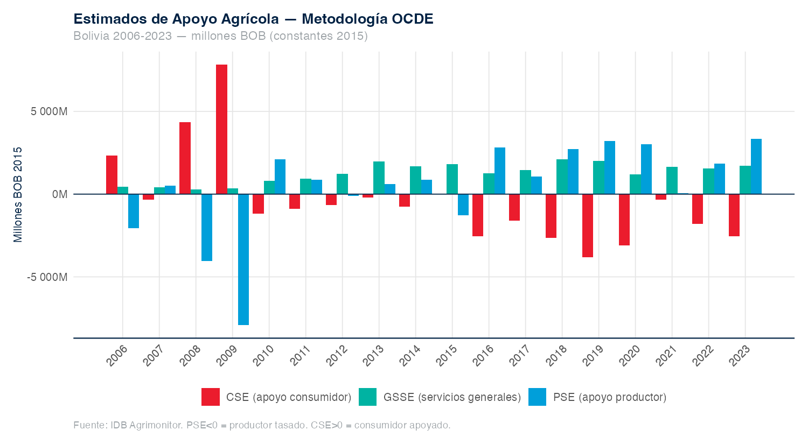
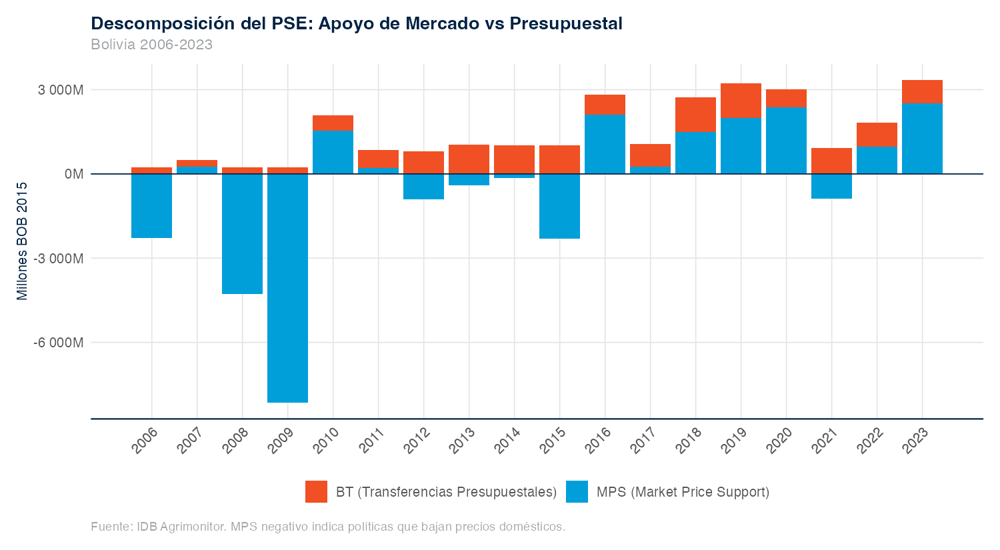
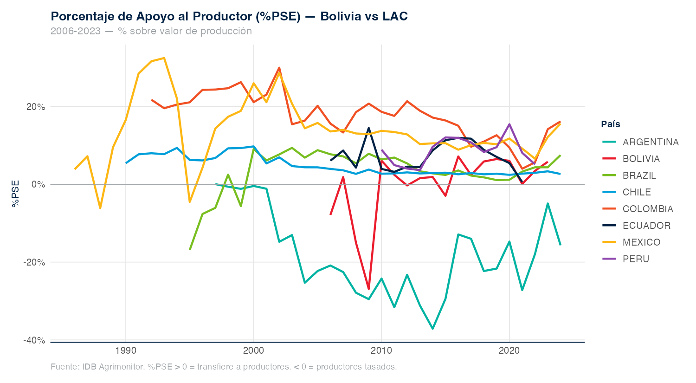
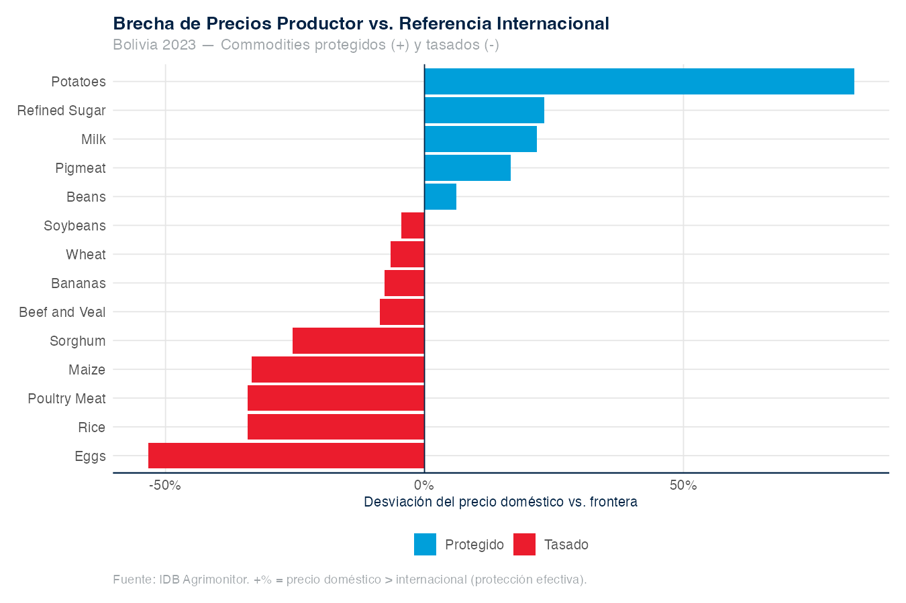
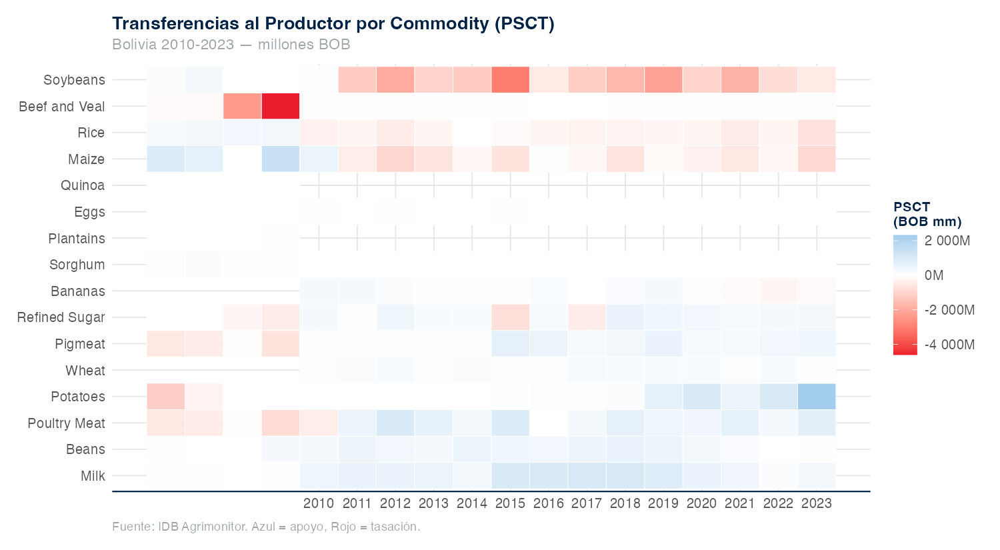
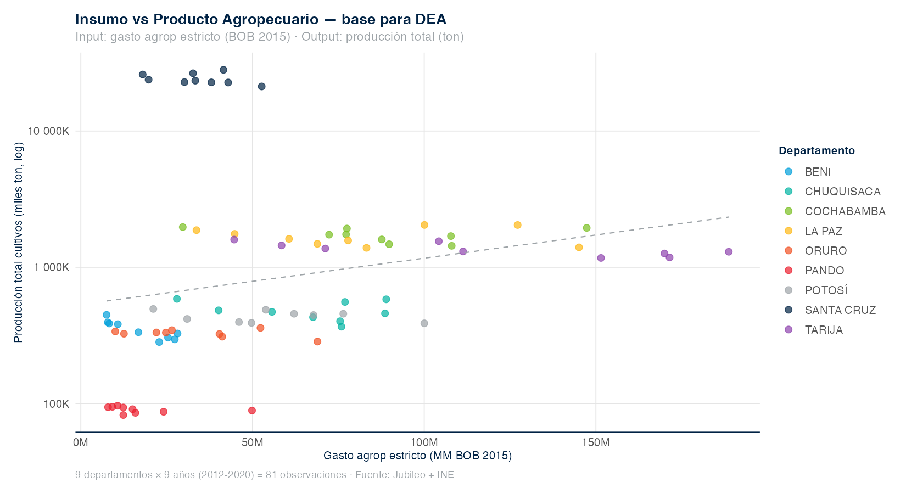
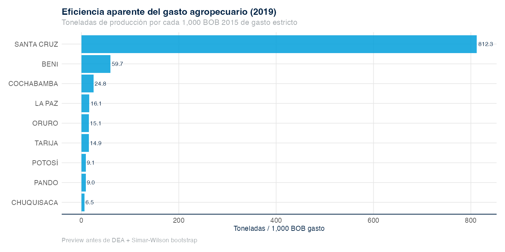

```{r}
#| include: false
source(here::here("02_code", "00_setup", "01_constants.R"))
library(tidyverse)
```

::: {.callout-note title="Síntesis del capítulo"}
- **Nivel del apoyo al productor.** El %PSE de Bolivia se ubicó en 5,8% del valor bruto de producción en 2018, quinto puesto entre los países LAC monitoreados por el IDB AgriMonitor [F02].
- **Patrón dual de protección comercial.** El NRP promedio del período más reciente fue −37% en soya y +46% en maíz; los cultivos exportables tributan implícitamente vía precios deprimidos, mientras los cultivos asociados a seguridad alimentaria reciben protección efectiva [F03].
- **Eficiencia técnica del gasto agropecuario.** La frontera DEA Simar-Wilson sobre el panel subnacional 2012–2020 cuantifica heterogeneidad entre departamentos y entre años; los scores ofrecen una métrica de cuánto producto adicional podría obtenerse manteniendo el nivel de insumos `[TODO_TRACE: scores DEA pendientes de ejecución]`.
- **Gasto y resultados sectoriales.** Regresiones panel con efectos fijos departamento y año examinan la relación entre gasto agropecuario per cápita rural y dos outcomes (TFP, FIES) bajo controles climáticos y de Ley 393/2014 `[TODO_TRACE: coeficientes pendientes de re-corrida de 08_extended_regressions.R sobre v12]`.
- **Implicación técnica.** La composición del apoyo —concentrada en MPS y transferencias presupuestarias generales, no en bienes públicos— delimita el espacio de repurposing examinado en el capítulo 6.
:::

Este capítulo combina cuatro miradas cuantitativas sobre el gasto agropecuario boliviano. La primera mide el **nivel y composición del apoyo al productor** bajo metodología OECD-PSE y lo compara con LAC (§5.1). La segunda descompone la **protección por commodity** mediante el Nominal Rate of Protection (§5.2). La tercera estima **eficiencia técnica** con Data Envelopment Analysis y bootstrap de Simar-Wilson (§5.3). La cuarta examina la **relación gasto-resultados** con regresiones panel de efectos fijos sobre el panel v12 (§5.4). Estas cuatro miradas sustentan los hallazgos **F02** (PSE 5,8%, 5° en LAC) y **F03** (patrón dual NRP), y proporcionan el sustrato analítico para las opciones de repurposing del capítulo 6.

La elección metodológica del capítulo —OECD-PSE para el benchmarking LAC, MAFAP/FAO para la clasificación dual de capítulos 3 y 4, DEA Simar-Wilson y panel FE para los análisis cuantitativos propios— sigue la guía consolidada por @OECD_PSE_Manual, @DeSalvoEtAl2018_IDB_AgSupportLAC y @SimarWilson1998. El crosswalk entre las cuatro clasificaciones (MAFAP ↔ OECD-PSE ↔ COFOG ↔ MEFP funcional) está documentado en el Apéndice D. La especificación inputs-outputs del DEA y la especificación econométrica del panel FE están detalladas en los Apéndices F y E, respectivamente.

::: {.callout-tip title="Qué añade el APER 2026 frente al APER 2011"}
El APER 2011 no incluyó análisis OECD-PSE ni estimación de Data Envelopment Analysis: su análisis del gasto se centró en composición funcional y arreglos institucionales. La presente actualización introduce ambos marcos por primera vez para Bolivia y los ancla en (i) la base IDB AgriMonitor LAC (1986–2024) construida por @DeSalvoEtAl2018_IDB_AgSupportLAC y mantenida por el @IDB_Agrimonitor, (ii) el manual OECD-PSE [@OECD_PSE_Manual] y la edición más reciente del Agricultural Policy Monitoring and Evaluation [@OECD2025_APME], y (iii) la metodología bootstrap de @SimarWilson1998 y su extensión de regresión en dos etapas [@SimarWilson2007], referenciada como cross-check con el stochastic frontier de la Box 11 del PER Sub-Saharan Africa [@FAO2021_PEFoodAgricultureSSA].
:::

## 5.1 Apoyo al productor: PSE, GSSE, TSE y benchmarking LAC {#sec-pse}

Esta sección responde dos preguntas: cuánto apoyo público recibe el productor agropecuario boliviano en relación con el valor de su producción, y cómo se compara ese nivel con el resto de LAC. El análisis OECD-PSE elaborado por el consultor STC aporta el insumo principal, integrado al panel v12 en el grupo G08 (43 variables, 2006–2023) y reportado por el @IDB_Agrimonitor.

### 5.1.1 Nivel del PSE: Bolivia y LAC {#sec-pse-nivel}

El Producer Support Estimate de Bolivia se ubicó en 5,8% del valor bruto de producción agropecuaria en 2018, el quinto nivel más alto entre los diez países LAC monitoreados por el IDB AgriMonitor en ese año. La figura 5.1 ordena el %PSE de 2018 para Argentina, Bolivia, Brasil, Chile, Colombia, Costa Rica, Ecuador, México, Paraguay y Perú; Brasil, Chile, Colombia y Argentina se ubican por encima del valor boliviano, mientras Paraguay, Ecuador, Perú, México y Costa Rica se sitúan por debajo (panel v12, grupo G08; serie IDB AgriMonitor edición 2024). El %PSE captura el conjunto de transferencias monetarias y no monetarias hacia el productor, incluyendo apoyo vía precios de mercado (MPS) y transferencias presupuestarias (BT); su lectura como "nivel de apoyo" depende de la composición interna, examinada en §5.1.2 [@OECD_PSE_Manual]. La posición intermedia de Bolivia en el ranking LAC indica que el gasto presupuestario directo de los capítulos 3 y 4 no agota el apoyo efectivo al productor: parte de ese apoyo no transita por la línea presupuestaria sino por el diferencial entre precio doméstico y precio frontera.

{#fig-pse-bolivia fig-alt="Series anuales de PSE, GSSE y CSE de Bolivia 2006–2023 como porcentaje del valor de producción agropecuaria. | Annual PSE, GSSE and CSE series for Bolivia 2006–2023 as percent of agricultural production value."}

La serie temporal del %PSE entre 2006 y 2023 muestra fluctuación en torno a un nivel medio sin tendencia monotónica clara. La figura 5.1 grafica las tres series anuales —PSE, GSSE y CSE— como porcentaje del valor de producción agropecuaria; la combinación PSE + GSSE constituye el Total Support Estimate (TSE) reportado por el IDB AgriMonitor (panel v12, grupo G08). La estabilidad relativa del nivel medio del %PSE contrasta con la expansión nominal del gasto agropecuario presupuestario documentada en el capítulo 3 (F01: inversión real ×10 entre 2000 y 2015); la divergencia se explica por el crecimiento simultáneo del valor bruto de producción, que actúa como denominador del %PSE `[TODO_TRACE: confirmar tasa de crecimiento real del VBP agro 2006–2023 contra panel v12 grupo G08]`. La descomposición por componente OECD-PSE, examinada en §5.1.2, indica qué tipo de instrumento dominó el apoyo al productor en el período.

### 5.1.2 Composición del PSE: MPS, transferencias presupuestarias y GSSE {#sec-pse-composicion}

La composición OECD-PSE del apoyo al productor boliviano muestra peso predominante del componente de apoyo vía precios de mercado (MPS) sobre las transferencias presupuestarias (BT) `[TODO_TRACE: shares promedio 2018–2023 de MPS, BT y GSSE pendientes de output Hector deliverable H2]`. La figura 5.2 descompone el TSE anual en sus tres categorías OECD-PSE: PSE (productor), GSSE (servicios generales al sector) y CSE (consumidor); cada serie corresponde al panel v12 grupo G08 (`PSE_BOB_2015`, `GSSE_BOB_2015`, `CSE_BOB_2015`). El MPS refleja el efecto agregado de barreras comerciales, restricciones cuantitativas a exportaciones e intervenciones de comercialización pública (EMAPA) sobre la diferencia entre precios domésticos y precios frontera; su cuantificación es sensible al precio de referencia internacional y al tratamiento del tipo de cambio, sensibilidad reportada como banda alta/media/baja [@OECD_PSE_Manual; @DeSalvoEtAl2018_IDB_AgSupportLAC]. La descomposición por commodity del MPS —que diferencia entre exportables protegidos negativamente y cultivos alimentarios protegidos positivamente— se desarrolla en §5.2 como Nominal Rate of Protection.

{#fig-pse-comp fig-alt="Descomposición anual del TSE de Bolivia 2006–2023 en MPS, transferencias presupuestarias y GSSE como porcentaje del TSE. | Annual decomposition of Bolivia's TSE 2006–2023 into MPS, budgetary transfers and GSSE as percent of TSE."}

### 5.1.3 GSSE: el componente de bienes públicos {#sec-gsse}

El General Services Support Estimate (GSSE) mide el gasto público en bienes públicos sectoriales —I+D, extensión, sanidad animal y vegetal, infraestructura sectorial— que no se transfiere directamente al productor individual. La figura 5.3 grafica el GSSE como porcentaje del TSE para Bolivia entre 2006 y 2023 y lo contrasta con el rango LAC reportado por @OECD2025_APME y el @IDB_Agrimonitor (panel v12 grupo G08 + serie IDB AgriMonitor edición 2024). La participación del GSSE en el TSE es un indicador estándar de la orientación del gasto hacia bienes públicos: la literatura comparada documenta retornos sociales más altos del gasto en I+D y extensión que del gasto en transferencias precio-distorsionantes [@Alston2011; @Hurley2014], con la salvedad metodológica sobre la métrica de retornos detallada abajo `[TODO_TRACE: GSSE/TSE Bolivia promedio 2018–2023 + benchmark LAC mediano pendiente del output Hector H2]`. La discusión del caveat metodológico sobre los retornos del I+D —y por qué los promedios reportados en la literatura sobreestiman los retornos realistas— se desarrolla en §5.4.

{#fig-gsse-lac fig-alt="GSSE de Bolivia como porcentaje del TSE en 2018 contrastado con el rango de comparadores LAC. | Bolivia's GSSE as percent of TSE in 2018 compared with the range of LAC comparators."}

::: {.callout-warning title="Caveat metodológico — retornos del I+D agropecuario"}
La literatura clásica sobre retornos del I+D agropecuario reporta medianas en torno a 40–50% de tasa interna de retorno [@Alston2011]. @Hurley2014 muestra que ese rango refleja un sesgo metodológico del cálculo IRR convencional cuando se aplica a flujos con horizontes largos: bajo el Modified Internal Rate of Return (MIRR) —que asume reinversión a la tasa de costo de capital y no a la TIR realizada— los retornos realistas se ubican en el rango **9–12%**. Esta banda corregida (9–12%) corresponde a estimaciones de la literatura internacional sobre retornos del I+D agropecuario y el APER 2026 la reporta como referencia metodológica de orden de magnitud —no como estimación para Bolivia—; su transferibilidad al contexto boliviano se discute en el capítulo 6.
:::

### 5.1.4 CSE: transferencias al consumidor {#sec-cse}

El Consumer Support Estimate captura el efecto neto sobre el consumidor de las intervenciones que afectan precios agropecuarios, incluyendo subsidios directos al consumo y el efecto-precio de las restricciones a exportaciones. La figura 5.1 incluye la serie anual del CSE como porcentaje del valor de consumo agropecuario para Bolivia entre 2006 y 2023 (panel v12, variable `CSE_BOB_2015`). Un CSE positivo indica subsidio neto al consumidor —vía precios deprimidos por restricciones a exportación o vía transferencias directas como las del programa EMAPA—; un CSE negativo indica taxación implícita al consumo. La señal y magnitud del CSE de Bolivia son contraparte mecánica del componente MPS del PSE, dado que el MPS se calcula a partir del mismo diferencial precio doméstico-frontera [@OECD_PSE_Manual]. El detalle por commodity del NRP, que descompone el patrón precio-doméstico-frontera por cultivo, se examina en §5.2.

## 5.2 Patrón dual de protección: NRP por commodity {#sec-nrp}

El apoyo al productor no es homogéneo entre cultivos: el destino comercial del producto define el signo de la protección. La métrica es el Nominal Rate of Protection (NRP), diferencial porcentual entre precio doméstico y precio frontera ajustado por costos de comercialización [@KruegerSchiffValdes1988; @AndersonRausserSwinnen2013]. Los datos provienen del grupo G08 del panel v12, con la serie extendida de NRP por commodity construida sobre IDB AgriMonitor + FAOSTAT Producer Prices + World Bank Pink Sheet (1991–2024, siete commodities).

### 5.2.1 NRP de exportables: soya y arroz {#sec-nrp-exportables}

El NRP promedio del período más reciente fue **−37% para soya** y **−33% para arroz**, indicando que el precio doméstico al productor se ubicó sistemáticamente por debajo del precio frontera ajustado en ambos cultivos. La figura 5.4 grafica la serie anual del NRP de soya y arroz entre 1991 y 2024, marcando los promedios del período más reciente como referencia (panel v12, `pse_nrp_extended.rds` construido sobre IDB AgriMonitor edición 2024 + FAOSTAT PP + WB Pink Sheet). La protección negativa de los exportables refleja el efecto combinado de restricciones cuantitativas a la exportación, autorizaciones administrativas de exportación y mecanismos de abastecimiento interno gestionados por EMAPA; el mecanismo genera taxación implícita al productor exportable equivalente a un impuesto a la exportación con tasa promedio cercana al valor absoluto del NRP [@KruegerSchiffValdes1988; @LopezGalinato2007]. La comparación con el patrón de cultivos asociados a seguridad alimentaria, examinada en §5.2.2, completa la descripción del patrón dual.

<!-- TODO_TRACE: verificar que el archivo fig16_price_gap_by_commodity_2023.png corresponde a la serie NRP 1991–2024 del caption (posible mismatch de archivo, sesión 11) antes de publicar -->
{#fig-nrp-exp fig-alt="Serie anual del Nominal Rate of Protection de soya y arroz en Bolivia 1991–2024, con los promedios del período más reciente marcados como referencia. | Annual Nominal Rate of Protection series for soybean and rice in Bolivia 1991–2024, with recent-period averages marked as reference."}

### 5.2.2 NRP de cultivos alimentarios: maíz y trigo {#sec-nrp-food}

El NRP promedio del período más reciente fue **+46% para maíz** y **+28% para trigo**, indicando que el precio doméstico al productor se ubicó sistemáticamente por encima del precio frontera ajustado en ambos cultivos alimentarios. La figura 5.5 grafica la serie anual del NRP de maíz y trigo entre 1991 y 2024 (panel v12, `pse_nrp_extended.rds`); el contraste con los exportables de §5.2.1 es la base cuantitativa del hallazgo F03. La protección positiva de los cultivos alimentarios se traduce en transferencia implícita desde consumidores hacia productores de maíz y trigo, equivalente a un subsidio a la producción con tasa promedio cercana al valor del NRP; el mecanismo opera vía aranceles, restricciones a importaciones e intervenciones de comercialización pública orientadas a sostener precios al productor de cultivos asociados a la canasta alimentaria nacional [@AndersonRausserSwinnen2013]. El patrón dual y sus implicaciones de economía política se examinan en conjunto en §5.2.3.

<!-- TODO_TRACE: verificar que el archivo fig17_psct_heatmap.png corresponde a la serie NRP 1991–2024 del caption (posible mismatch de archivo, sesión 11) antes de publicar -->
{#fig-nrp-food fig-alt="Serie anual del Nominal Rate of Protection de maíz y trigo en Bolivia 1991–2024. | Annual Nominal Rate of Protection series for maize and wheat in Bolivia 1991–2024."}

### 5.2.3 Interpretación del patrón dual {#sec-nrp-interpret}

La combinación de NRP negativo en soya y arroz con NRP positivo en maíz y trigo configura un patrón dual de política comercial: tributación implícita a los exportables y protección efectiva a los cultivos alimentarios. La diferencia algebraica entre las tasas promedio reportadas en §5.2.1 y §5.2.2 alcanza 83 puntos porcentuales entre soya (−37%) y maíz (+46%) y 61 puntos porcentuales entre arroz (−33%) y trigo (+28%) (panel v12, `pse_nrp_extended.rds`). La asimetría es consistente con el patrón documentado por @AndersonRausserSwinnen2013 para economías agrícolas con orientación dual hacia mercados externos y abastecimiento alimentario interno: el sesgo de política grava implícitamente al sector exportador para sostener precios al productor alimentario y precios moderados al consumidor; @LopezGalinato2007 muestra que el patrón coexiste con subasignación crónica de gasto en bienes públicos en países LAC. La cifra del precio doméstico de caña 2015 (261 USD/t vs referencia 37 USD/t) está bajo verificación con INE y queda flageada como caveat en el Apéndice F. La cuantificación del MPS agregado consistente con este patrón dual y su lectura en el marco repurposing —donde el cierre del diferencial podría liberar recursos para bienes públicos sin elevar techo fiscal [@WorldBank2024_RepurposingSupport; @Damania2023]— se desarrolla en el capítulo 6.

::: {.callout-note title="Opción técnica anticipada (desarrollada en cap. 6)"}
El patrón dual NRP define un espacio de repurposing examinable: la reducción gradual del MPS sobre maíz y trigo podría liberar recursos fiscales y reducir la taxación implícita al consumidor, con magnitud sensible al precio de referencia internacional (banda alta/media/baja, consistente con la incertidumbre declarada para el MPS); la reducción simultánea de restricciones a exportación de soya y arroz reduciría la taxación implícita al productor exportador. La presentación del escenario reconoce el trade-off distributivo del componente exportable: la relajación de restricciones a exportación modifica precios domésticos con efecto sobre el consumidor, dimensión cuya cuantificación y secuenciación se desarrolla en el escenario técnico S01 del capítulo 6 a la luz de F06. La combinación no requiere incremento del techo fiscal y es consistente con el ejercicio de repurposing global documentado por @WorldBank2024_RepurposingSupport y @Damania2023. El detalle cuantitativo se presenta como escenario técnico S01 en el capítulo 6.
:::

## 5.3 Eficiencia técnica del gasto: DEA Simar-Wilson {#sec-dea}

Esta sección responde una pregunta complementaria a §5.1: dado el nivel y composición del gasto observado, ¿cuánto producto adicional podría obtenerse con los mismos insumos si cada departamento operara sobre la frontera de eficiencia? El score DEA Simar-Wilson mide esa distancia a la frontera; se computa sobre el `dea_dataset.rds` (panel subnacional 2012–2020, 81 unidades de decisión, 32 variables; ver Apéndice F para especificación inputs-outputs).

### 5.3.1 Especificación inputs-outputs {#sec-dea-spec}

La especificación DEA del APER 2026 combina insumos fiscales (gasto agropecuario per cápita rural, gasto en bienes públicos sectoriales), insumos productivos (área cultivada, mano de obra agropecuaria) e insumos climáticos (precipitación CHIRPS, déficit hídrico) con outputs de valor agregado agropecuario departamental y rendimiento promedio de cultivos representativos. La tabla F.1 del Apéndice F detalla las variables exactas, sus fuentes y el tratamiento de valores faltantes; el conjunto cubre 9 departamentos × 9 años = 81 unidades de decisión `[TODO_TRACE: matriz inputs-outputs final pendiente de cierre de especificación; decisión orientación input vs output abierta — proponer en ADR (Open question 9.6 §1)]`. La elección de orientación —input (minimizar insumos dado el output) versus output (maximizar output dado el nivel de insumos)— afecta la interpretación del score: la orientación input es coherente con la pregunta de policy "¿se podría obtener el mismo producto con menos gasto?", mientras que la orientación output responde "¿cuánto producto adicional podría obtenerse con el mismo gasto?" [@SimarWilson1998]. La especificación final se cierra mediante ADR antes de la corrida definitiva y se ancla cruzadamente con la Box 11 del PER Sub-Saharan Africa [@FAO2021_PEFoodAgricultureSSA].

### 5.3.2 Bootstrap Simar-Wilson y bandas de confianza {#sec-dea-bootstrap}

La estimación DEA convencional genera scores deterministas que ignoran la incertidumbre estadística asociada al muestreo de unidades; el bootstrap de @SimarWilson1998 corrige este sesgo y permite construir bandas de confianza alrededor del score de cada unidad. Bajo la especificación del Apéndice F, la corrida bootstrap con 2000 réplicas genera scores corregidos y sus intervalos al 95% para cada uno de los 81 pares departamento-año `[TODO_TRACE: scores bootstrap + bandas de confianza pendientes de ejecución sobre dea_dataset.rds]`. La interpretación operativa del score es: una unidad con score = 1 opera sobre la frontera estimada; una unidad con score = 0,7 podría obtener 30% más output (orientación output) o utilizar 30% menos insumo (orientación input) si replicara las prácticas observadas en las unidades frontera; la banda de confianza acota la incertidumbre estadística pero **no** la incertidumbre de modelo —especificación de inputs-outputs, retornos a escala, valores faltantes— que se reporta en sensibilidad separada [@SimarWilson1998; @SimarWilson2007]. La heterogeneidad de scores entre departamentos y años, examinada en §5.3.3, ubica esta métrica en el territorio analizado en el capítulo 4.

{#fig-dea-spec fig-alt="Diagrama de la especificación DEA del APER 2026: insumos fiscales, productivos y climáticos vinculados a outputs de valor agregado agropecuario y rendimiento de cultivos. | Diagram of the APER 2026 DEA specification: fiscal, productive and climatic inputs linked to outputs of agricultural value added and crop yields."}

### 5.3.3 Heterogeneidad temporal y subnacional {#sec-dea-hetero}

La distribución de scores DEA entre los 9 departamentos y los 9 años del panel permite identificar (i) unidades frontera consistentes, (ii) unidades con brecha de eficiencia estable y (iii) trayectorias de convergencia o divergencia respecto a la frontera. La figura 5.6 representará el panel de scores Simar-Wilson como heatmap departamento × año (orden departamental por score promedio); el complemento se reporta en el Apéndice F como tabla con scores puntuales y bandas `[TODO_TRACE: heatmap pendiente de output DEA]`. La heterogeneidad esperada combina dotación productiva diferencial (Santa Cruz vs altiplano), capacidad institucional subnacional (cap. 4 — F07: PAR III 16% ejecución) y exposición climática diferencial (precipitación CHIRPS, déficit hídrico); la interpretación operativa de la brecha "departamento i en año t opera 30% por debajo de la frontera" requiere desagregar cuánto de esa brecha es atribuible a dotación, a institucionalidad o a clima. La regresión en segunda etapa de Simar-Wilson [@SimarWilson2007] sobre determinantes de la eficiencia se reporta como complemento al panel FE de §5.4.

{#fig-dea-2019 fig-alt="Eficiencia simple por departamento de Bolivia en 2019, figura preparatoria a reemplazar por scores Simar-Wilson. | Simple efficiency by Bolivian department in 2019, preparatory figure to be replaced by Simar-Wilson scores."}

### 5.3.4 Cross-check con stochastic frontier (PER SSA Box 11) {#sec-dea-sfa}

El stochastic frontier analysis ofrece una alternativa paramétrica al DEA no-paramétrico y permite cross-check de los rankings de eficiencia bajo supuestos distribucionales sobre el término de error. La Box 11 del PER Sub-Saharan Africa [@FAO2021_PEFoodAgricultureSSA] reporta una aplicación de stochastic frontier sobre 13 países africanos que permite comparar metodológicamente con la corrida DEA del APER 2026 `[TODO_TRACE: correlación de Spearman entre rankings DEA y SFA pendiente de corrida]`. Una correlación de Spearman alta entre los dos rankings indica que el ordenamiento es estable frente a la elección de método; una correlación baja indica sensibilidad a supuestos metodológicos y motiva reportar resultados bajo ambas especificaciones [@SimarWilson2007]. La integración entre DEA, SFA y panel FE como tres miradas complementarias sobre la relación gasto-resultados es el insumo final del capítulo y se examina en §5.4.

## 5.4 Gasto y resultados: regresiones panel con efectos fijos {#sec-panel-fe}

La pregunta operativa central del capítulo es si el gasto agropecuario público boliviano se asocia con mejoras en productividad y seguridad alimentaria una vez controlada la heterogeneidad departamental, la tendencia temporal y cambios estructurales como Ley 393/2014. El análisis usa el panel v12 a nivel departamento-año (n = 9 × 17 = 153 observaciones potenciales) y produce tablas de regresión mediante `02_code/03_analysis/08_extended_regressions.R` `[TODO_TRACE: script pendiente de re-corrida sobre v12]`.

### 5.4.1 Especificación econométrica {#sec-panel-spec}

La especificación base es un panel con efectos fijos de departamento y año, errores estándar agrupados al nivel departamental y dummies estructurales para Ley 393/2014 y COVID-19. La ecuación canónica es:

$$
Y_{it} = \beta_1 \ln(G_{it}) + \beta_2 \ln(G_{it-1}) + \mathbf{X}_{it}'\gamma + \mathbf{Z}_{it}'\delta + \alpha_i + \tau_t + \varepsilon_{it}
$$

donde $Y_{it}$ es el outcome del departamento $i$ en el año $t$ (TFP en la especificación 1, FIES en la especificación 2), $G_{it}$ es el gasto agropecuario per cápita rural en BOB 2015 constantes, $\mathbf{X}_{it}$ son controles climáticos (precipitación CHIRPS, déficit), $\mathbf{Z}_{it}$ incluye `post_ley393` y un dummy COVID, $\alpha_i$ son efectos fijos departamentales y $\tau_t$ son efectos fijos anuales (especificación implementada con `fixest::feols`; clustering al nivel departamental). La identificación del efecto del gasto sobre el outcome es asociativa, no causal: la magnitud captura la correlación condicional una vez retiradas la heterogeneidad fija departamental, la tendencia temporal común y los choques estructurales identificables. Los resultados de las dos especificaciones se presentan en §5.4.2 (TFP) y §5.4.3 (FIES).

::: {.callout-tip title="Tabla 5.1 — Especificación econométrica del panel FE (referencia rápida)"}

| Componente | Especificación |
|---|---|
| Outcome 1 | TFP departamental (USDA-ERS, proyección INE) |
| Outcome 2 | Inseguridad alimentaria FIES (panel v12, ECV/MECOVI–EH armonizado) |
| Regresor principal | `ln(gasto_agro_pc_rural_real_2015_BOB)` + rezago |
| Controles climáticos | precipitación CHIRPS dept, déficit hídrico |
| Dummies estructurales | `post_ley393` (Ley 393/2014); `covid` (2020–2021) |
| Efectos fijos | departamento + año |
| Clustering errores estándar | departamento (HC1 robusto) |
| Implementación | `fixest::feols` |
| Período | 2008–2024 (ventana canónica APER 2026) |

:::

### 5.4.2 Resultado principal: gasto agropecuario y TFP {#sec-panel-tfp}

La regresión panel FE estima la elasticidad TFP-gasto agropecuario controlando por efectos fijos y choques estructurales `[TODO_TRACE: coeficiente $\beta_1$, error estándar y nivel de significancia pendiente de re-corrida sobre v12]`. La tabla 5.2 reportará la especificación completa con columnas para variantes (sin rezago, con rezago, con interacción `post_ley393`); las cifras de gof_map incluyen N, R² ajustado y prueba F-conjunta de efectos fijos. La interpretación operativa de una elasticidad positiva y significativa es que un incremento de 10% en el gasto agropecuario per cápita rural se asocia con un incremento de $10 \cdot \hat{\beta}_1$ puntos porcentuales en el índice de TFP; la coherencia con el hallazgo F01 (inversión real ×10 frente a TFP estancada, capítulo 2) requiere lectura conjunta: el agregado nacional puede ocultar heterogeneidad departamental que el panel FE expone. La cifra es sensible a la elección del deflactor, a la inclusión del rezago y a la ventana temporal —los resultados de robustez se reportan en §5.4.4. El contraste con la regresión sobre seguridad alimentaria (§5.4.3) y con los scores DEA (§5.3) permite triangular la lectura: convergencia entre métricas refuerza la conclusión, divergencia identifica espacios de investigación adicional.

### 5.4.3 Resultado FIES: gasto agropecuario y seguridad alimentaria {#sec-panel-fies}

La segunda especificación reemplaza TFP por la prevalencia de inseguridad alimentaria moderada o severa (FIES) como outcome `[TODO_TRACE: coeficiente $\beta_1$ sobre FIES, error estándar y signo pendiente de re-corrida sobre v12]`. La tabla 5.3 reportará la especificación FIES con la misma estructura de controles que §5.4.2; el outcome se construye sobre el panel v12 a partir de la armonización ECV–MECOVI–EH descrita en el Apéndice E. La interpretación operativa de un coeficiente negativo y significativo es que un incremento del gasto agropecuario per cápita se asocia con una reducción de $|\hat{\beta}_1|$ puntos porcentuales en la prevalencia de inseguridad alimentaria moderada/severa; la lectura conjunta con el hallazgo F06 (pobreza rural 55→40→45%, FIES 49→74% entre 2012 y 2024) sugiere que el gasto agregado por sí solo no explica la dinámica reciente del FIES y que la composición del gasto importa más que el nivel —insumo directo para el repurposing del capítulo 6 [@WorldBank2024_RepurposingSupport; @SpringmannFreund2022].

### 5.4.4 Robustez: deflactor, ventana, clustering, especificaciones alternativas {#sec-panel-robust}

Las regresiones panel FE de §5.4.2 y §5.4.3 se reportan bajo seis variantes de robustez para acotar la sensibilidad metodológica de los coeficientes. El Apéndice E lista las variantes: (i) deflactor BOB 2015 IPC general vs deflactor agropecuario específico; (ii) ventana 2008–2024 canónica vs 2010–2023 acotada vs panel completo 1996–2024; (iii) clustering al nivel departamental vs municipal vs no-clustering con errores HC3; (iv) inclusión/exclusión del rezago del gasto; (v) interacción `post_ley393` × gasto para identificar cambio estructural en la elasticidad; (vi) regresión con instrumental variable de @AnriquezFosterOrtega2020_RuralSubsidiesLAC sobre transferencias rurales como check de endogeneidad `[TODO_TRACE: 6 variantes pendientes de implementación]`. La estabilidad del signo y magnitud del coeficiente a través de las variantes se reporta como métrica de robustez; cambio de signo bajo alguna variante motiva discusión metodológica explícita en el Apéndice E. La triangulación entre OECD-PSE (§5.1), NRP (§5.2), DEA (§5.3) y panel FE (§5.4) consolida el diagnóstico cuantitativo del gasto agropecuario boliviano y delimita el espacio de repurposing examinado en el capítulo 6.

## 5.5 Síntesis y puente al capítulo 6 {#sec-sintesis}

El análisis cuantitativo del capítulo 5 produce dos hallazgos cifrados (F02, F03) y tres bloques de evidencia en consolidación (PSE descompuesto, DEA Simar-Wilson, panel FE). El %PSE de Bolivia se ubica en 5,8% del valor bruto de producción (2018, 5° puesto LAC) y el patrón dual NRP combina −37% en soya / −33% en arroz con +46% en maíz / +28% en trigo; ambos hallazgos están registrados en `04_HALLAZGOS.md` con su contrato JSON [F02, F03]. La lectura conjunta indica que (i) Bolivia opera en el rango intermedio del apoyo al productor en LAC, (ii) el apoyo es composicionalmente sesgado hacia MPS sobre bienes públicos (GSSE), (iii) el patrón comercial dual delimita un espacio de repurposing examinable sin requerir aumento del techo fiscal, y (iv) la relación gasto-resultados a nivel departamental y la eficiencia técnica subnacional requieren completarse con las corridas pendientes para cerrar el diagnóstico. El capítulo 6 traduce este diagnóstico en tres opciones técnicas de repurposing (S01, S02, S03) para consideración del MEFP, con composición ex-ante/ex-post explícita y bandas de incertidumbre por escenario [@WorldBank2024_RepurposingSupport; @Damania2023].

::: {.callout-note title="Notas de cierre del capítulo 5"}
- **Trazabilidad.** Las cifras del %PSE 2018 (5,8%) y del NRP por commodity (−37% soya, +46% maíz, etc.) provienen del panel v12 grupo G08 (`PSE_BOB_2015`, `pse_nrp_extended.rds`) construido sobre IDB AgriMonitor edición 2024 + FAOSTAT PP + WB Pink Sheet; OECD-PSE y NRP son estándar internacional [@OECD_PSE_Manual; @KruegerSchiffValdes1988] y DEA Simar-Wilson y panel FE están en uso amplio en la literatura PER reciente [@SimarWilson1998; @FAO2021_PEFoodAgricultureSSA].
- **Incertidumbre declarada.** MPS sensible a precio de referencia internacional (banda alta/media/baja, Apéndice F); NRP de caña 2015 bajo verificación con INE; DEA pendiente de decisión orientación input vs output (ADR a generar); regresiones FE pendientes de re-corrida sobre v12.
- **Lo que NO concluye este capítulo.** No establece causalidad gasto → outcome (la inferencia es asociativa); no recomienda instrumentos específicos (eso es capítulo 6); no juzga el desempeño de instituciones individuales (eso es capítulo 4).
:::

<!-- Sinergia STC: cifras OECD-PSE actualizadas con edición IDB AgriMonitor feb-2026 son input del consultor STC (deliverable H2); cifras de fiscal cost del repurposing son input H4 (capítulo 6) — ver .agent/21_COORDINACION_STC.md -->
<!-- Validez metodológica absorbida en bullet Trazabilidad (sesión edición anti-IA): OECD_PSE_Manual, KruegerSchiffValdes1988, SimarWilson1998, FAO2021_PEFoodAgricultureSSA -->

<!--
draft_status: v0.1
written_by: aper-writer (sesión 13)
date: 2026-05-24
blockers: DEA Simar-Wilson + 08_extended_regressions.R + inputs Hector (H2: PSE/GSSE/TSE actualizado IDB feb-2026; H4: repurposing fiscal cost)
pending: scores DEA + bandas Simar-Wilson; tablas regresión §5.4.2 §5.4.3 §5.4.4 (6 variantes); GSSE breakdown 2018-2023 + benchmark LAC mediano; shares MPS/BT/GSSE del TSE 2018-2023; cross-check Spearman DEA vs SFA; caña 2015 verificación INE
citas: green=WorldBank2024_RepurposingSupport, AndersonRausserSwinnen2013, Damania2023, KruegerSchiffValdes1988, OECD2025_APME, OECD_PSE_Manual, DeSalvoEtAl2018_IDB_AgSupportLAC, SpringmannFreund2022, FAO2021_PEFoodAgricultureSSA. yellow=Alston2011, Hurley2014, SimarWilson1998, SimarWilson2007, LopezGalinato2007, AnriquezFosterOrtega2020_RuralSubsidiesLAC, IDB_Agrimonitor. red excluidas=FAOUNEPUNDP2021 (TEMA repurposing); AlstonPardey2000 (cifras TIR fabricadas); Anriquez2017IDB; Gautam2022 (PDF descargado mismatch — sustituido por WorldBank2024_RepurposingSupport, marcador CITA NECESARIA en línea ~80 hasta resolver auditoría); MasonDCroz2022 (PDF mismatch); Rentschler2017 (PDF mismatch); FundacionSolon2023 + FundacionTierra2024 no aplican al capítulo.
TODO_TRACE_count: 14
-->
