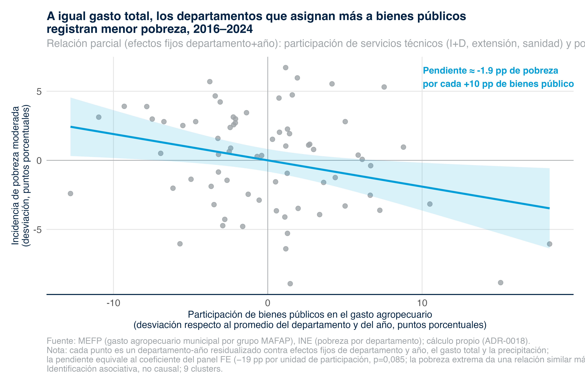

```{r}
#| include: false
suppressPackageStartupMessages({
  library(data.table)
  library(gt)
})

prod <- readRDS(here::here("01_data", "processed", "panel_fe_productivity_results.rds"))
pov  <- readRDS(here::here("01_data", "processed", "panel_fe_poverty_results.rds"))
btyp <- readRDS(here::here("01_data", "processed", "panel_fe_by_type_results.rds"))

# Formateo común: coeficiente con asteriscos de significancia + (EE) + p
fmt_coef <- function(coef, se, p) {
  star <- ifelse(p < 0.01, "***", ifelse(p < 0.05, "**", ifelse(p < 0.10, "*", "")))
  sprintf("%.3f%s", coef, star)
}
fmt_se <- function(se) sprintf("(%.3f)", se)
fmt_p  <- function(p)  sprintf("%.2f", p)
```

Este apéndice documenta el panel departamento-año de efectos fijos que sustenta la §5.4 del capítulo 5. Reúne la ecuación, la especificación, las tablas completas de coeficientes leídas de los RDS de resultados, y la totalidad de los caveats. La identificación es **asociativa, no causal**, y todas las cifras se reproducen desde los `panel_fe_*_results.rds` (scripts `09`, `10`, `11`) bajo la especificación fijada en el ADR-0018.

::: {.callout-warning appearance="simple"}
**Estado metodológico.** Los coeficientes son asociaciones condicionales una vez absorbidos los efectos fijos de departamento y año; no son efectos causales. La inferencia descansa en nueve departamentos (pocos clusters), por lo que los niveles de significancia cluster-robustos son anticonservadores. El gasto MEFP municipal solo está disponible desde 2016. Ver §E.5 para el listado completo de limitaciones.
:::

## E.1 Ecuación del panel de efectos fijos

La especificación base es un panel con efectos fijos de departamento y de año y errores cluster-robustos al nivel departamental:

$$
Y_{it} = \beta\,\ln(G_{it}) + \mathbf{X}_{it}'\gamma + \alpha_i + \tau_t + \varepsilon_{it}
$$

donde:

- $Y_{it}$ es el resultado del departamento $i$ en el año $t$: $\ln$(producción agrícola / superficie cultivada) —productividad de la tierra, ton/ha, INE— en la especificación de productividad, e incidencia de pobreza departamental (moderada o extrema, INE) en la especificación de bienestar.
- $G_{it}$ es el gasto agropecuario en USD constantes de 2015. El insumo **principal** es el gasto agropecuario municipal ejecutado del MEFP (Presupuesto Abierto, devengado, 2016–2024); la serie consolidada de Jubileo (2012–2021) se usa como robustez y ventana larga.
- $\mathbf{X}_{it}$ es la precipitación departamental (CHIRPS, en miles de mm).
- $\alpha_i$ son efectos fijos de departamento y $\tau_t$ son efectos fijos de año.

Con $\tau_t$ en la ecuación, los indicadores de timing fijo `post_ley393` (Ley 393/2014) y `covid` quedan colineales con los efectos de año; por ello solo se reportan en la variante con efectos fijos de departamento únicamente (M7).

## E.2 Especificación y estimador

| Componente | Especificación |
|---|---|
| Unidad de análisis | departamento × año (9 departamentos) |
| Resultado 1 (productividad) | `ln(producción agrícola / superficie cultivada)`, ton/ha (INE); robustez: `ln(PIB agropecuario)` y `ln(rendimiento de cereales)` |
| Resultado 2 (bienestar) | incidencia de pobreza departamental moderada y extrema (INE, Encuestas de Hogares) |
| Insumo fiscal principal | `ln(gasto agro municipal MEFP)`, USD const. 2015, 2016–2024 |
| Insumo fiscal robustez | `ln(gasto agro Jubileo consolidado)`, 2012–2021 (ventana larga) |
| Control climático | precipitación departamental (CHIRPS, miles mm) |
| Indicadores de timing | `post_ley393`, `covid` — solo en variante con FE de departamento (M7) |
| Efectos fijos | departamento + año |
| Errores estándar | cluster-robustos por departamento (`sandwich::vcovCL`, HC1/CR1) |
| Implementación | base R `lm` + `sandwich`; inferencia con $t(G-1)=t(8)$ |
| Identificación | asociativa, no causal |

**Por qué base R `lm` y no `fixest`.** El paquete `fixest` no está instalado ni en el `renv.lock` del proyecto; usarlo rompería el invariante de reproducibilidad. La combinación `lm` + `sandwich::vcovCL` reproduce los efectos fijos bidireccionales (mediante dummies de departamento y año) y la matriz de covarianza cluster-robusta sin dependencias nuevas. La inferencia emplea la distribución $t$ con $G-1 = 8$ grados de libertad, consistente con el número de clusters.

**Dos series de gasto que no son intercambiables.** El gasto MEFP (municipal, devengado) y el gasto Jubileo (consolidado) correlacionan 0,75 en niveles pero solo **0,17 *within-department*** (variación año a año tras descontar la media departamental). Miden variación distinta y los resultados se leen por separado por fuente.

## E.3 Resultados de NIVEL: el gasto total no se asocia con los resultados

### E.3.1 Productividad de la tierra

```{r}
#| label: tab-e-productividad
#| tbl-cap: "Panel FE — gasto agropecuario y productividad de la tierra (coeficiente del gasto y de la precipitación, por modelo)"
pc <- as.data.table(prod$coef)
pc[, etiqueta := fcase(
  term == "ln_gasto_mefp",   "ln(gasto MEFP)",
  term == "ln_gasto_jub",    "ln(gasto Jubileo)",
  term == "ln_gasto_jub_l1", "ln(gasto Jubileo, rezago)",
  term == "ln_rural",        "ln(gasto rural amplio)",
  term == "precip_k",        "precipitación (miles mm)",
  term == "post_ley393",     "post Ley 393",
  term == "covid",           "COVID",
  default = term)]
pc[, valor := paste0(fmt_coef(coef, se, p), " ", fmt_se(se))]
pc[, pval := fmt_p(p)]

prod_tbl <- pc[, .(Modelo = model, Término = etiqueta, `Coef. (EE)` = valor, p = pval, N = n)]

gt(prod_tbl) |>
  tab_source_note("Coeficiente con asteriscos de significancia (* p<0,10; ** p<0,05; *** p<0,01), error estándar cluster-robusto entre paréntesis. Fuente: `01_data/processed/panel_fe_productivity_results.rds` (script 09).") |>
  tab_options(table.font.size = px(9), data_row.padding = px(2))
```

**Lectura.** Ninguna variante del gasto alcanza significancia al 10% sobre la productividad de la tierra. En la especificación principal (M1, gasto MEFP 2016–2020) el coeficiente es +0,005 (p=0,90, N=45). Con la ventana larga de Jubileo (M2, 2012–2020) sube a +0,032 pero sigue sin significancia (p=0,25, N=81). Los outcomes alternativos —PIB agropecuario (M5) y rendimiento de cereales (M6)— y el gasto rural amplio (M4) confirman el nulo. La única asociación marginalmente significativa es `post_ley393` en M7 (FE de departamento únicamente), que no altera la lectura del gasto.

### E.3.2 Pobreza departamental

```{r}
#| label: tab-e-pobreza
#| tbl-cap: "Panel FE — gasto agropecuario y pobreza departamental: la asociación negativa NO es robusta a fuente ni ventana"
qc <- as.data.table(pov$coef)
qc <- qc[term %in% c("ln_gasto_mefp", "ln_gasto_jub")]
qc[, etiqueta := fifelse(term == "ln_gasto_mefp", "ln(gasto MEFP)", "ln(gasto Jubileo)")]
qc[, valor := paste0(fmt_coef(coef, se, p), " ", fmt_se(se))]
qc[, pval := fmt_p(p)]

pov_tbl <- qc[, .(Modelo = model, `Gasto` = etiqueta, `Coef. (pp) (EE)` = valor, p = pval, N = n)]

gt(pov_tbl) |>
  tab_source_note("Coeficiente en puntos porcentuales de incidencia de pobreza por unidad de ln(gasto); asteriscos de significancia (* p<0,10; ** p<0,05; *** p<0,01), error estándar cluster-robusto entre paréntesis. Fuente: `01_data/processed/panel_fe_poverty_results.rds` (script 10).") |>
  tab_options(table.font.size = px(9), data_row.padding = px(2))
```

**Lectura.** Con el dato oficial más reciente (gasto MEFP), el gasto no se asocia con la pobreza: el signo es incluso ligeramente positivo y sin significancia tanto en pobreza moderada (P2: +1,2 pp, p=0,76, N=72) como en extrema (P3: +0,2 pp, p=0,96, N=68). La asociación **negativa** aparece solo con la serie Jubileo: en la ventana antigua 2012–2018 alcanza −4,96 pp (P5, p<0,01) en pobreza moderada y −3,68 pp (P6, p=0,05) en extrema, pero con Jubileo en la ventana reciente 2016–2021 cae a −2,31 pp y pierde significancia al 5% (P4, p=0,09). El signo depende de la fuente de gasto y de la ventana temporal: **el "dividendo de pobreza" del nivel de gasto no es un hallazgo robusto.**

### E.3.3 Las dos series de pobreza no se encadenan

La incidencia de pobreza departamental del INE proviene de dos metodologías de Canasta Básica Alimentaria que **no son encadenables**: la serie antigua `cba_2011_2018` y la vigente `cba_2016_2024`. El solape 2016–2018 muestra un salto de nivel de orden 4–9 pp atribuible al cambio metodológico, no a un cambio real de bienestar. Por ello cada serie se estima por separado y los coeficientes se leen dentro de su propia metodología; los modelos P1–P3 usan la canasta vigente y P5–P6 la antigua. La pobreza INE es **total** departamental, no rural: la incidencia rural por departamento solo vive en microdatos confidenciales fuera del repositorio.

## E.4 Resultados de COMPOSICIÓN: el tipo de gasto sí importa

```{r}
#| label: tab-e-composicion
#| tbl-cap: "Panel FE — composición del gasto y resultados: a igual gasto total, mayor participación de bienes públicos se asocia con menor pobreza"
bc <- as.data.table(btyp$coef)
bc[, etiqueta := fcase(
  term == "sh_tecnicos", "participación I+D/extensión/sanidad",
  term == "ln_total",    "ln(gasto total)",
  term == "ln_tecnicos", "ln(gasto I+D)",
  term == "ln_apoyo",    "ln(gasto apoyo directo)",
  term == "ln_riego",    "ln(gasto riego/infra)",
  term == "precip_k",    "precipitación (miles mm)",
  default = term)]
bc[, valor := paste0(fmt_coef(coef, se, p), " ", fmt_se(se))]
bc[, pval := fmt_p(p)]
bc <- bc[term != "precip_k"]

comp_tbl <- bc[, .(Modelo = model, Término = etiqueta, `Coef. (EE)` = valor, p = pval, N = n)]

gt(comp_tbl) |>
  tab_source_note("Modelos BT1–BT3: participación de bienes públicos + nivel de gasto total. Modelos BT4–BT8: gasto por tipo individual (multicolineales entre sí). Coeficientes de pobreza en puntos porcentuales por unidad de participación (proporción 0–1); asteriscos (* p<0,10; ** p<0,05; *** p<0,01); EE cluster-robusto entre paréntesis. Fuente: `01_data/processed/panel_fe_by_type_results.rds` (script 11) sobre `gasto_agro_prog_muni_grupo.rds` (MEFP, grupos MAFAP).") |>
  tab_options(table.font.size = px(9), data_row.padding = px(2))
```

**Lectura.** A igual nivel de gasto total, una mayor participación de bienes públicos (I+D, extensión, sanidad) se asocia con menor pobreza departamental: −19,0 pp en pobreza moderada por una unidad de participación (BT2, p=0,085) y −17,8 pp en pobreza extrema (BT3, p=0,019), mientras el nivel de gasto total en el mismo modelo no se distingue de cero (+0,2 y −0,8, ambos ns). En orden de magnitud, reasignar ~10 puntos del gasto hacia bienes públicos —manteniendo constante el gasto total— se asocia con ~1,8–1,9 pp menos de pobreza. Las regresiones de nivel por tipo individual (BT4–BT8) son ruidosas y mayormente no significativas por la **multicolinealidad entre tipos de gasto**: los cuatro grupos co-mueven a nivel departamental, lo que impide separar limpiamente el efecto de cada uno cuando se introducen como niveles. Por eso la especificación informativa es la de participación a gasto total constante (BT1–BT3), no la de niveles individuales.

La @fig-e-avplot ilustra la relación parcial (after partialling-out de los efectos fijos, el gasto total y la precipitación) entre la participación de bienes públicos y la pobreza moderada: la pendiente del scatter equivale al coeficiente BT2.

{#fig-e-avplot fig-alt="Diagrama de dispersión de la relación parcial entre la participación de bienes públicos en el gasto agropecuario y la pobreza moderada departamental, ambas residualizadas contra efectos fijos de departamento y año, el gasto total y la precipitación; la línea de ajuste tiene pendiente negativa equivalente al coeficiente del panel FE. | Scatter plot of the partial relationship between the public-goods share of agricultural spending and departmental moderate poverty, both residualized against department and year fixed effects, total spending and rainfall; the fit line has a negative slope equal to the fixed-effects panel coefficient."}

## E.5 Caveats

1. **Identificación asociativa, no causal.** Los coeficientes capturan correlación condicional tras absorber la heterogeneidad fija departamental y la tendencia temporal común; no identifican efectos causales.
2. **Pocos clusters.** Con nueve departamentos, la inferencia cluster-robusta es anticonservadora. El **wild cluster bootstrap** (p.ej. `fwildclusterboot`) queda como refinamiento pendiente; los p-valores reportados se leen con esa salvedad.
3. **Multicolinealidad de tipos de gasto.** Los cuatro grupos de gasto co-mueven a nivel departamental; los modelos de nivel por tipo individual (BT4–BT8) no permiten separar limpiamente el efecto de cada tipo. La especificación informativa es la de participación a gasto total constante.
4. **Ventana del gasto MEFP.** El gasto agropecuario municipal del MEFP solo está disponible desde 2016 (la API no expone gestiones anteriores), lo que acota la ventana de la especificación principal a 2016–2024.
5. **Dos series de gasto con baja correlación within-department.** MEFP (municipal) y Jubileo (consolidado) correlacionan solo 0,17 *within-department*: es además un caveat de calidad de medición del gasto subnacional.
6. **Pobreza total, no rural; series no encadenables.** La pobreza INE es total departamental (la rural por departamento solo vive en microdatos confidenciales) y las dos metodologías de canasta básica no se encadenan; cada una se lee dentro de su metodología.
7. **Productividad de la tierra como medida cruda.** $\ln$(producción/ha) agrega toneladas de cultivos heterogéneos; el PIB agropecuario, alternativa de valor agregado, tiene N corto (2017–2021).

## E.6 Trazabilidad

| Resultado | RDS | Script | Datos de entrada |
|---|---|---|---|
| Productividad (NIVEL) | `panel_fe_productivity_results.rds` | `02_code/03_analysis/09_panel_fe_productivity.R` | `subnacional_productivity_panel.rds` (construido por `12_build_productivity_panel.R`) |
| Pobreza (NIVEL) | `panel_fe_poverty_results.rds` | `02_code/03_analysis/10_panel_fe_poverty.R` | `ine_pobreza_departamental.rds` (recolectado por `34_ine_poverty_departamental.R`) |
| Composición (por tipo) | `panel_fe_by_type_results.rds` | `02_code/03_analysis/11_panel_fe_by_type.R` | `gasto_agro_prog_muni_grupo.rds` (MEFP, grupos MAFAP) |

Especificación canónica: ADR-0018. Insumo fiscal principal: gasto agropecuario municipal ejecutado del MEFP (Presupuesto Abierto, devengado, USD const. 2015, 2016–2024).
