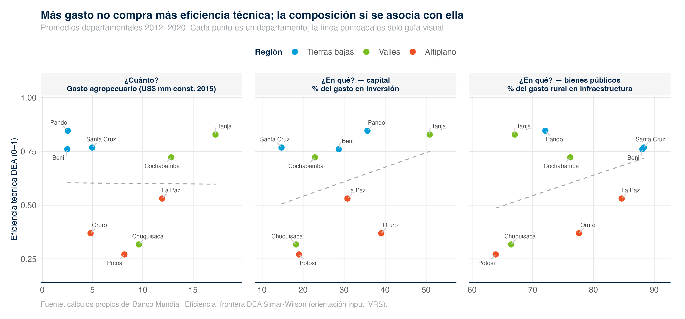

```{r}
#| include: false
suppressPackageStartupMessages({ library(data.table); library(knitr) })
res <- readRDS(here::here("01_data", "processed", "dea_simar_wilson_results.rds"))
fc  <- function(x, d = 2) gsub("\\.", ",", formatC(round(as.numeric(x), d), format = "f", digits = d))
ds  <- as.data.table(res$dept_summary)[order(-eff_in_bc_mean)]
ds[, grupo := ifelse(eff_in_bc_mean > 0.60, "Cerca de la frontera", "Brecha mayor")]
```

Esta sección responde una pregunta práctica: con el gasto público agropecuario que ya existe, ¿están todos los departamentos obteniendo el mayor producto posible, o algunos podrían lograr lo mismo con menos recursos? Para responderla, el reporte compara los nueve departamentos entre sí y mide qué tan lejos está cada uno del mejor desempeño observado —la **frontera de eficiencia**—. La técnica empleada (Data Envelopment Analysis con la corrección estadística de Simar-Wilson) se documenta en detalle en el Apéndice F; aquí se presentan los resultados y cómo leerlos.

**Cómo se lee el resultado.** A cada departamento y año se le asigna un puntaje entre 0 y 1. Un puntaje de 1 significa que el departamento marca la frontera: nadie obtiene más producto con tan pocos recursos. Un puntaje de 0,60 significa que ese departamento podría, en principio, alcanzar el mismo producto usando alrededor de 40 % menos insumos si operara como los más eficientes. El "insumo" combina el gasto agropecuario y la superficie cultivada; el "producto", la producción física y el rendimiento de los cultivos.

**Un gradiente geográfico nítido.** En promedio, los departamentos bolivianos operan en 0,60. Detrás de ese promedio hay un patrón claro: los departamentos de tierras bajas y valles operan cerca de la frontera, mientras que los del altiplano y Chuquisaca muestran las mayores brechas. Ningún departamento del altiplano marca la frontera en ningún año del período 2012–2020.

```{r}
tab <- ds[, .(Departamento = dept_upper,
              `Eficiencia (0–1)` = fc(eff_in_bc_mean),
              `Lectura` = grupo)]
kable(tab, caption = "Eficiencia técnica media por departamento, 2012–2020 (mayor = mejor)")
```


**La brecha no es solo de gestión.** Antes de leer estos resultados como "el altiplano gestiona mal", el análisis verifica cuánto de la brecha se explica por factores que el gasto no controla. La precipitación resulta determinante: los departamentos con menos lluvia tienden a registrar menor eficiencia. Es decir, una parte de la brecha del altiplano refleja una **desventaja agroclimática estructural**, no únicamente decisiones de gestión.

**Un resultado robusto.** El ordenamiento de los departamentos se mantiene cuando se cambian los supuestos del cálculo —qué se mide como producto, cómo se define el gasto, o la orientación del análisis—. Esto da confianza en que el patrón refleja diferencias reales y no un artificio del método.

**¿Importa cuánto se gasta, o en qué?** Los departamentos que más gastan no son los más eficientes: el nivel del gasto agropecuario no ordena la eficiencia (panel izquierdo). Pando y Beni, con presupuestos pequeños, operan cerca de la frontera, mientras que algunos departamentos que gastan más se ubican lejos de ella. Lo que sí muestra asociación es la composición, vista por dos lentes complementarios: los departamentos que destinan una porción mayor de su gasto a inversión —capital, no gasto corriente— y a infraestructura tienden a estar más cerca de la frontera (paneles central y derecho). A esto se suma la región, con el altiplano sistemáticamente por debajo. La intuición de política es directa: el margen de mejora pasa menos por aumentar el presupuesto y más por la composición del gasto —hacia capital y bienes públicos— y por atender la desventaja agroclimática. (Estas asociaciones son sugestivas, con nueve departamentos; el detalle se documenta en el Apéndice F.)



**Lectura operativa.** Existe margen para que los departamentos rezagados se acerquen al desempeño de los líderes, pero una parte de la brecha es estructural. El diseño de instrumentos de gasto se beneficia de distinguir lo atribuible a la gestión —donde la mejora es alcanzable replicando buenas prácticas— de lo atribuible a la dotación agroclimática, que requiere instrumentos diferentes. El detalle de scores por departamento y año, las bandas de confianza y el análisis de los factores asociados a la eficiencia se reportan en el Apéndice F.
