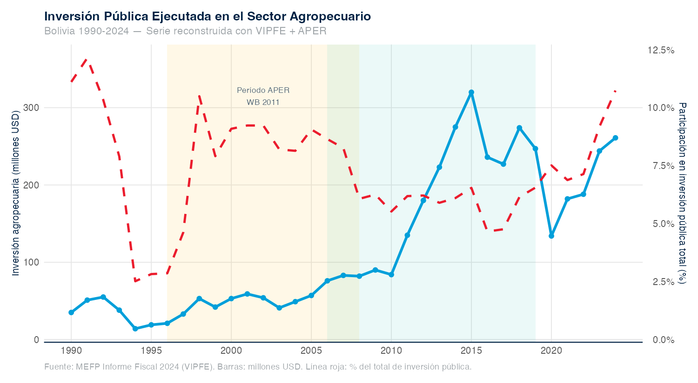
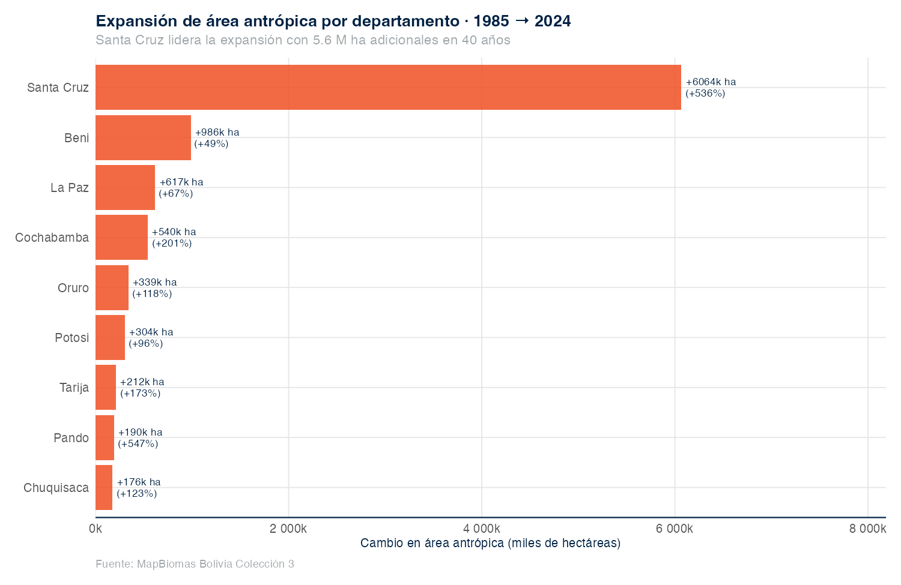

# {.section-header}

## Hoja de ruta

::: {.columns}
::: {.column}
**1 · El punto de partida**

Estructura, fuentes y limitaciones del APER 2011.

**2 · Lo que actualizamos**

Datos en perspectiva: igual, mejorado, nuevo.

**3 · Lo que es nuevo en 2026**

Cinco adiciones metodológicas que el 2011 no tenía.

:::
::: {.column}

**4 · Hallazgos preliminares**

Ocho señales que ya emergen de los datos.

**5 · Próximos pasos**

Gaps abiertos, cronograma y decisiones que pedimos hoy.

:::
:::

# 1 · El punto de partida {.section-header}

## ¿Por qué partimos del APER 2011?

::: {.columns}
::: {.column width="55%"}

**Banco Mundial · Marzo 2011**

- Único diagnóstico integral del **gasto público agropecuario** en Bolivia previo a este encargo.
- Construyó la **base de datos APER**, hoy todavía referencia para MDRyT y gobernaciones.
- Definió las **categorías funcionales** del gasto agropecuario: investigación, extensión, riego, insumos, sanidad, desarrollo productivo, recursos naturales y administración.
- Es el **ancla metodológica** de continuidad para esta actualización.

:::
::: {.column width="45%"}

::: {.metric}
[Período cubierto]{.metric-label}
[**1996 — 2008**]{.metric-big}
13 años · 327 municipios · 9 departamentos
:::

::: {.metric}
[Equipo gobierno]{.metric-label}
Ministerio de Planificación · MDRyT · MEFP · Ministerio de Autonomías
:::

:::
:::

::: {.source}
Fuente: Banco Mundial (2011) "Estado Plurinacional de Bolivia: Agriculture Public Expenditure Review", LCSAR.
:::

## Estructura del APER 2011

| Capítulo | Contenido |
|:--------:|-----------|
| **Resumen Ejecutivo** | Mensajes centrales y opciones de política |
| **1. Introducción** | Objetivos, justificación, alcance, metodología |
| **2. Desempeño del sector** | Perspectivas histórica, política y económica |
| **3. Presupuestos e instituciones** | Procesos presupuestarios y rol sectorial |
| **4. Organización del gasto** | Nacional · Subnacional · Mecanismos de transferencia |
| **5. Análisis del gasto** | **Eficacia** · **Eficiencia técnica** · **Equidad** |
| **6. Recomendaciones** | Tres ejes de política |

::: {.callout-note appearance="simple"}
La actualización **mantiene este esqueleto** de seis capítulos. Los ajustes ocurren dentro: nuevas fuentes en el Cap. 2, mejor organización del gasto en el Cap. 4 y un Cap. 5 sustancialmente ampliado con benchmarks OECD.
:::

## Fuentes de datos del APER 2011

::: {.columns}
::: {.column width="55%"}

**Núcleo: la "base APER"**

- **Ministerio de Economía y Finanzas Públicas** — ejecución presupuestaria por programa y proyecto.
- **Federación de Asociaciones Municipales (FAM)** — clasificación funcional 1996-2008.
- **UDAPE** — validación y agregación.

**Fuentes complementarias**

- **FAO** — gasto público agropecuario.
- **Indicadores de Desarrollo Mundial (WDI)** — comparadores macro.
- **Índice VAM** — vulnerabilidad alimentaria municipal.
- **Encuesta primaria** — 40 municipios rurales aleatorios (institucional).

:::
::: {.column width="45%"}

::: {.callout-important appearance="simple"}
**Limitaciones reconocidas en 2011**

- Datos detallados solo hasta 2008.
- Sin métricas internacionales tipo OECD (PSE / GSSE / NRP).
- No mide eficiencia técnica con métodos no-paramétricos (DEA).
- Sin datos satelitales (uso del suelo, clima).
- Sin microdatos de hogares posteriores a 2008.
- No analiza el rol del crédito agropecuario.
:::

:::
:::

## Mensajes centrales del APER 2011

1. **Bajo nivel de gasto** público agropecuario respecto al peso económico del sector.
2. **Composición desbalanceada** — concentración en gastos "integrales" sin desagregación clara.
3. **Subejecución persistente** del presupuesto aprobado, especialmente subnacional.
4. **Inequidad espacial** — el gasto no se concentra donde más se necesita.
5. **Eficiencia técnica heterogénea** entre departamentos.
6. **Escasos vínculos** entre planificación, presupuesto y resultados sectoriales.

::: {.callout-tip appearance="simple"}
La actualización **no redefine el problema** diagnosticado en 2011. Lo mide con datos 17 años más recientes, métodos más robustos y dos lentes nuevos: apoyo al productor + crédito subsidiado.
:::

# 2 · Lo que actualizamos {.section-header}

## El esfuerzo de datos en una sola lámina

::: {.columns}
::: {.column}

::: {.metric}
[Período cubierto]{.metric-label}
[**1990 — 2024**]{.metric-big}
35 años · 9 departamentos · 339 municipios
:::

::: {.metric}
[Microdatos de hogares]{.metric-label}
[**309 mil personas**]{.metric-big}
Encuesta de Hogares 2012-2024 · 8 rondas
:::

::: {.metric}
[Microdatos agropecuarios]{.metric-label}
[**20 600 unidades productivas**]{.metric-big}
ENA 2008 + ENA 2015 · primera vez integrados
:::

:::
::: {.column}

::: {.metric}
[Pipeline reproducible]{.metric-label}
[**Todo en R + Quarto**]{.metric-big}
Datos, análisis y reporte en un solo flujo
:::

::: {.metric}
[Cobertura territorial]{.metric-label}
[**3 niveles**]{.metric-big}
Nacional · 9 departamentos · 339 municipios
:::

::: {.metric}
[Línea de tiempo política]{.metric-label}
[**61 hitos**]{.metric-big}
Política agropecuaria 1990-2025
:::

:::
:::

## Cobertura por capítulo: 2011 vs 2026

| Capítulo | APER 2011 | APER 2026 | |
|---|---|---|:---:|
| **2. Desempeño** | INE 1996-2008 | INE 1984-2024 + USDA TFP + FAOSTAT | mejorado |
| **3. Presupuestos** | MEFP 1996-2008 | MEFP 1990-2024 + 7 fichas MDRyT | mejorado |
| **4. Organización del gasto** | Base APER 1996-2008 | Base APER + Jubileo 2012-2021 + transferencias | mejorado |
| **5a. Eficacia** | Departamental | Departamental + municipal (3 368 obs) | mejorado |
| **5b. Eficiencia técnica** | Frontera estocástica | **DEA con bootstrap Simar-Wilson** | nuevo |
| **5c. Apoyo al productor** | — | **PSE / GSSE / NRP — metodología OECD** | nuevo |
| **5d. Crédito agropecuario** | — | **Serie histórica + Ley 393/2014** | nuevo |
| **5e. Clima y suelo** | — | **CHIRPS · MapBiomas · Hansen** | nuevo |
| **5f. Pobreza y FIES** | Índice VAM | **Encuesta de Hogares 2012-2024 + FIES** | nuevo |
| **5g. Microdatos UPA** | — | **ENA 2008 + ENA 2015 + CNA 2013** | nuevo |

## Mapa de fuentes — Bolivia e internacional

::: {.columns}
::: {.column}

**Fiscal · Presupuestario**

- Ministerio de Economía y Finanzas Públicas (MEFP / VIPFE)
- Banco Mundial — base BOOST
- Fundación Jubileo — SIIF municipal y departamental
- Memorias institucionales del MDRyT

**Producción · UPA · Hogares**

- Instituto Nacional de Estadística — Estadísticas Agrícolas, Encuestas de Hogares y Encuestas Nacionales Agropecuarias
- Censo Nacional Agropecuario 2013

**Crédito · Sistema financiero**

- Banco Central de Bolivia — Boletín Estadístico

:::
::: {.column}

**Internacionales · Comparadores**

- Banco Mundial — WDI · Pink Sheet de commodities
- BID — AgriMonitor (PSE / GSSE / NRP en LAC)
- IFPRI — base SPEED
- USDA — Total Factor Productivity
- FAOSTAT — producción y precios productor
- OECD — metodología PSE
- CEPAL — comparadores LAC

**Satelital · Geoespacial**

- MapBiomas Bolivia — uso del suelo 1985-2024
- Hansen Global Forest Change — deforestación anual
- CHIRPS — precipitación

:::
:::

::: {.source}
Todas las series tienen cadena de procesamiento auditada y documentada. El acceso a datos primarios institucionales está en gestión activa con MEFP.
:::

# 3 · Lo nuevo en 2026 {.section-header}

## Cinco adiciones metodológicas que el 2011 no tenía

::: {.columns}
::: {.column}

**1 · Apoyo al productor — métricas OECD**

PSE, GSSE, TSE y NRP por commodity. Permite **comparar Bolivia con el resto de LAC** y descomponer entre apoyo a precios y servicios generales.

**2 · Eficiencia técnica con DEA + bootstrap**

81 unidades de decisión (9 departamentos × 9 años, 2012-2020). Mejora frente a la frontera estocástica del 2011 al **no asumir forma funcional** y permitir intervalos de confianza.

**3 · Crédito agropecuario y Ley 393/2014**

Serie histórica del Banco Central con dummy estructural por la Ley 393. Tema **ausente** en 2011: ahora explica la **sustitución de inversión pública** por crédito subsidiado.

:::
::: {.column}

**4 · Datos satelitales — clima y uso del suelo**

- Precipitación CHIRPS por departamento.
- Frontera agropecuaria municipal MapBiomas 1985-2024.
- Deforestación anual Hansen 2001-2023.

Permite vincular **gasto → cobertura → resultados** de manera espacialmente explícita.

**5 · Microdatos de hogares y UPAs**

- Encuesta de Hogares 2012-2024 → pobreza rural y **inseguridad alimentaria FIES**, que reemplaza el Índice VAM del 2011.
- ENA 2008 + 2015 + CNA 2013 → **escenario UPA-level** que en 2011 sólo se aproximaba con muestreos pequeños.

:::
:::

## Lo que se mantiene del APER 2011

::: {.columns}
::: {.column}

**Marco analítico**

- Las **3E**: Eficacia · Eficiencia · Equidad.
- Definición de **Agricultura y Relacionado con Agricultura** (estándar FAM / COFOG / FAO).
- Estructura del informe en seis capítulos.
- Análisis multi-nivel: nacional · departamental · municipal.

**Estándares internacionales**

- Clasificación funcional COFOG-FAO.
- Año base constante para deflactar (2005 → ahora 2015 INE).

:::
::: {.column}

**Hilo narrativo central**

> "Bolivia tiene un sector agropecuario estratégico para reducir pobreza rural y garantizar seguridad alimentaria, pero la eficiencia y composición del gasto público siguen siendo el cuello de botella."

::: {.callout-tip appearance="simple"}
La continuidad metodológica con el APER 2011 es **deliberada**: usamos las mismas categorías de gasto siempre que es posible, para asegurar comparabilidad de las series largas.
:::

:::
:::

# 4 · Hallazgos preliminares {.section-header}

## Hallazgo 1 — Inversión 10× pero TFP estancada

::: {.columns}
::: {.column width="42%"}

- La inversión pública agropecuaria pasó de **~70 millones USD** (1990) a más de **600 millones USD** (2014).
- En contraste, el **índice de productividad total de factores** apenas creció: el sector ha incorporado más recursos, no más productividad.

::: {.callout-important appearance="simple"}
**Es el hallazgo más fuerte del APER 2026:** si el sector hubiera convertido inversión en productividad, Bolivia debería estar 30-40 % más arriba en TFP que en 1990. No lo está. El problema **no es el nivel** del gasto, es su **composición y ejecución**.
:::

:::
::: {.column width="58%"}

{width="100%"}

:::
:::

::: {.source}
Fuentes: VIPFE-MEFP (inversión sectorial) y USDA Economic Research Service (TFP), Bolivia 1990-2023.
:::

## Hallazgo 2 — PSE Bolivia 5.8 % (5.º en LAC)

::: {.columns}
::: {.column width="42%"}

- **PSE 2023 Bolivia = 5.8 %** del valor de la producción.
- Detrás de México (6.6 %), Colombia (5.6 %) — entre Perú (5.1 %) y Brasil (4.4 %).
- Los **servicios generales** (GSSE) crecieron **8 ×** desde 2006.
- Bolivia es el país **más volátil** de LAC en %PSE: -27 % (2009) → +7 % (2016).

:::
::: {.column width="58%"}

{width="100%"}

:::
:::

::: {.source}
Fuente: BID AgriMonitor 2006-2023 — metodología OECD adaptada para América Latina.
:::

## Hallazgo 3 — Patrón dual de protección (NRP)

| Cultivo | NRP 1991-2005 | NRP 2006-2023 | Lectura |
|---|:-:|:-:|---|
| **Soya** | −37 % | −34 % | Exportable taxado (precio doméstico < mundial) |
| **Arroz** | −33 % | −32 % | Taxado vía controles a la exportación |
| **Sorgo** | −53 % | −47 % | Taxado consistentemente |
| **Maíz** | +46 % | +39 % | Protegido (seguridad alimentaria) |
| **Trigo** | +28 % | +21 % | Protegido |
| **Cebada** | +31 % | +65 % | Cada vez más protegida |
| **Caña** | −50 % | +56 % | **Cambio drástico** post-2006 |

::: {.callout-tip appearance="simple"}
Bolivia **taxa los exportables** y **subsidia implícitamente la canasta alimentaria** — política de soberanía alimentaria explícita pero costosa para el productor del oriente.
:::

::: {.source}
NRP = (precio doméstico − precio referencia mundial) / precio referencia × 100. Fuentes: FAOSTAT (precios productor 1991-2025) y Banco Mundial Pink Sheet (referencia mundial).
:::

## Hallazgo 4 — Bolivia nunca alcanzó la meta de Maputo

::: {.columns}
::: {.column width="42%"}

- **Compromiso Maputo (2003):** 10 % del presupuesto público al sector agropecuario.
- **Bolivia, máximo histórico:** 3.48 % en 1990.
- **Promedio 2000-2007:** 2.2 %.
- **Ranking LAC en gasto agro / PIB:** Bolivia 9 de 24 — por encima de Argentina, Chile y Perú, pero lejos de Brasil y México.

::: {.callout-important appearance="simple"}
La discusión sobre **suficiencia del gasto** debe partir de un dato simple: Bolivia ha financiado al sector muy por debajo de lo que firmó internacionalmente.
:::

:::
::: {.column width="58%"}

{width="100%"}

:::
:::

::: {.source}
Fuentes: IFPRI SPEED 2019 y VIPFE-MEFP (extensión hasta 2024).
:::

## Hallazgo 5 — Sustitución gasto público → crédito subsidiado

::: {.columns}
::: {.column width="55%"}

- **Inversión pública agro / PIB** cayó de **0.97 %** (2015) a **0.38 %** (2021).
- **Crédito bancario al agro** subió de **5.1 %** del crédito total (2010) a **11.7 %** (2024) — Ley 393 / 2014 + Bancos PYME.
- Cartera agropecuaria total: **1.4 → 3.4 mil millones USD** entre 2015 y 2024.
- **Banco de Desarrollo Productivo (BDP):** 68 % de su cartera está en agropecuario.

:::
::: {.column width="45%"}

::: {.metric}
[Inversión pública agro]{.metric-label}
[**0.97 % → 0.38 %**]{.metric-big}
del PIB · 2015-2021
:::

::: {.metric}
[Crédito bancario agro]{.metric-label}
[**5.1 % → 11.7 %**]{.metric-big}
del crédito total · 2010-2024
:::

:::
:::

::: {.callout-tip appearance="simple"}
**Hipótesis del APER 2026:** la política agropecuaria post-2014 movió la palanca pública desde **inversión presupuestaria** hacia **crédito mandatorio con tasas subsidiadas**. Es un instrumento distinto, con incidencia distributiva distinta, y no aparecía en el APER 2011.
:::

::: {.source}
Fuentes: VIPFE-MEFP y Banco Central de Bolivia · Boletín Estadístico (2010-2024).
:::

## Hallazgo 6 — Pobreza rural se revierte tras 2021

::: {.columns}
::: {.column width="55%"}

- **Pobreza rural:** 55.2 % (2012) → 40.3 % (2021) → **45.1 % (2024)**.
- **Pobreza extrema rural:** 36.2 % → 16.5 % → **21.6 %**.
- **Inseguridad alimentaria FIES:** 41.3 % (2019) → **65.1 % (2024)** — tendencia muy preocupante.
- Empleo agropecuario rural sigue en **67 %** (2023) — diversificación lenta.

:::
::: {.column width="45%"}

::: {.metric}
[Pobreza rural Bolivia]{.metric-label}
[**40 → 45 %**]{.metric-big}
2021-2024 · reversión
:::

::: {.metric}
[FIES inseguridad alimentaria]{.metric-label}
[**41 → 65 %**]{.metric-big}
2019-2024 · alarmante
:::

::: {.metric}
[Departamentos más pobres rural]{.metric-label}
Chuquisaca 64 % · Oruro 54 % · Potosí 54 %
:::

:::
:::

::: {.source}
Fuente: INE — Encuesta de Hogares 2012-2024 (309 185 personas, 8 rondas). FIES disponible 2019, 2021, 2022, 2023, 2024.
:::

## Hallazgo 7 — Ejecución MDRyT 2024 y la señal del PAR III

| Línea | % financiero | % físico |
|---|:-:|:-:|
| MDRyT consolidado 2019 | 83 % | — |
| MDRyT consolidado 2024 | **74 %** | **54 %** |
| **PAR III (Banco Mundial) 2024** | 16 % | 60 % |
| IPD-PACU 2021 | 44.7 % | — |
| SENASAG inversión 2019 | 25 % | — |

::: {.callout-important appearance="simple"}
**PAR III ejecutó solo 16 % de su presupuesto financiero en 2024.** Es la señal más crítica para esta APER: cuello de botella en gestión, no en disponibilidad de recursos.
:::

::: {.source}
Fuentes: Memorias y Reportes de Programación y Cumplimiento del MDRyT, INIAF e IPD-PACU 2014-2024.
:::

## Hallazgo 8 — La frontera agropecuaria avanza sobre el bosque

::: {.columns}
::: {.column width="42%"}

- Bolivia perdió **9.4 millones de ha** de bosque en 40 años (1985-2024).
- **Santa Cruz concentra 64 %** de la expansión agropecuaria.
- **Soya** expandió +131 % en 2008-2015 (563 000 → 1.3 millones de ha).
- **Bovinos en Santa Cruz** +65 % en el mismo período (2.2 → 3.7 millones de cabezas).
- **Top municipios** de expansión: San Ignacio de Velasco, San José, Pailón, Cuatro Cañadas — todos en Santa Cruz.

:::
::: {.column width="58%"}

{width="100%"}

:::
:::

::: {.source}
Fuentes: MapBiomas Bolivia (1985-2024), Hansen Global Forest Change (2001-2023) y Encuestas Nacionales Agropecuarias 2008 y 2015.
:::

# 5 · Próximos pasos {.section-header}

## Gaps abiertos y la carta MEFP

::: {.columns}
::: {.column width="55%"}

**Gaps que requieren gestión institucional**

- 🔴 **MDRyT, INIAF y SENASAG** — ejecución desagregada 2009-2024.
- 🟡 **Memorias MDRyT** — años 2015-2018, 2020 y 2022-2023.
- 🟡 **BDP** — cartera detallada por commodity y región.
- 🟡 **Fundación Jubileo** — SIIF municipal extendido.
- 🟢 **INIAF y SENASAG** — operativos por departamento.

:::
::: {.column width="45%"}

::: {.callout-note appearance="simple"}
**Carta de solicitud al MEFP — lista**

Genérica, firmable por el Representante Residente del Banco Mundial, con tres anexos:

1. Portada del APER 2011
2. Listado de variables solicitadas
3. Acuerdo de confidencialidad

Quedan cinco campos formales por completar antes del envío (fecha, firmante, cargo, correo, teléfono).
:::

:::
:::

## Lo que necesitamos

1. **Validación del alcance** — ¿confirmamos los seis capítulos del esqueleto APER más dos anexos?
2. **Priorización de los ocho hallazgos preliminares** — ¿cuáles convertimos en mensajes centrales del informe?
3. **Insumos para el Capítulo 6 (recomendaciones)** — ¿qué decisiones de política está tomando el gobierno hoy donde el APER puede aportar?
4. **Carta MEFP** — completar firmante y fecha. ¿La oficina del Banco Mundial en Bolivia es el canal correcto?
5. **Acceso a datos** — ¿hay ventanillas internas para BOOST 2009+, BDP y Jubileo extendido?
6. **Audiencia y entregables** — ¿reporte completo + nota corta de política + tablero web?

# Gracias {.section-header}

**Juan Carlos Muñoz-Mora**

Universidad EAFIT · Medellín, Colombia

[jmunozm1@eafit.edu.co](mailto:jmunozm1@eafit.edu.co)

::: {.source}
Banco Mundial · Universidad EAFIT · 27 de abril de 2026.
:::
