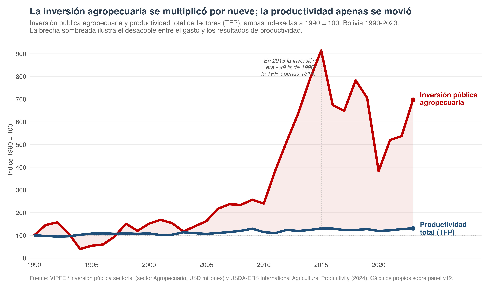
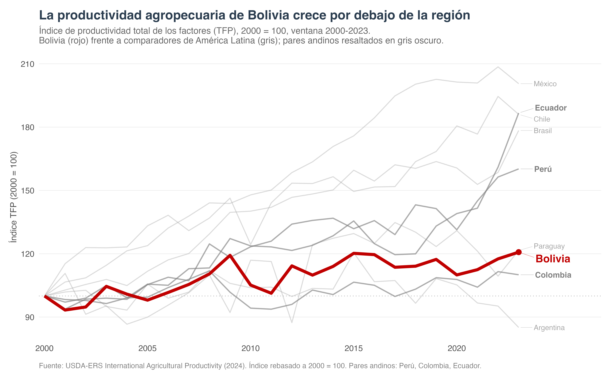
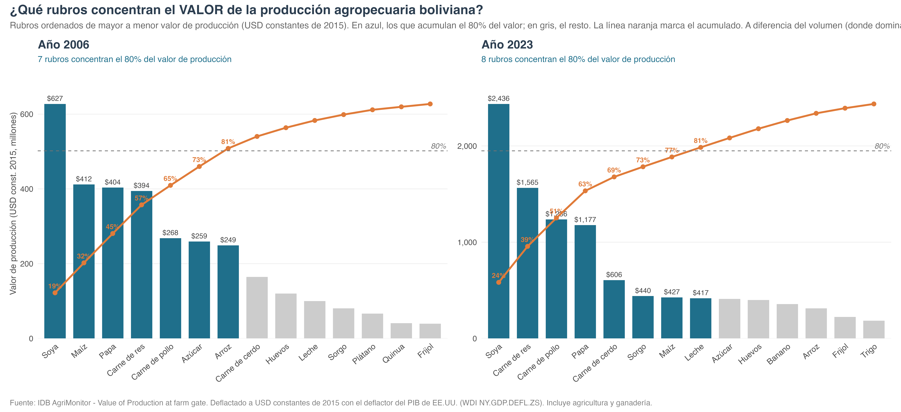
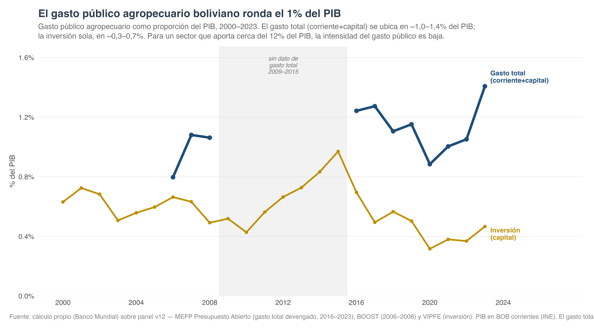
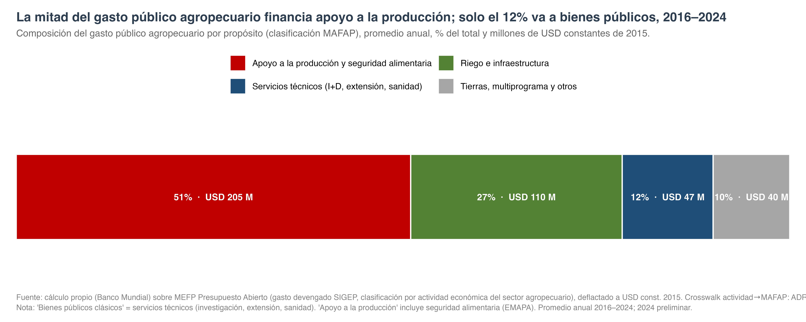
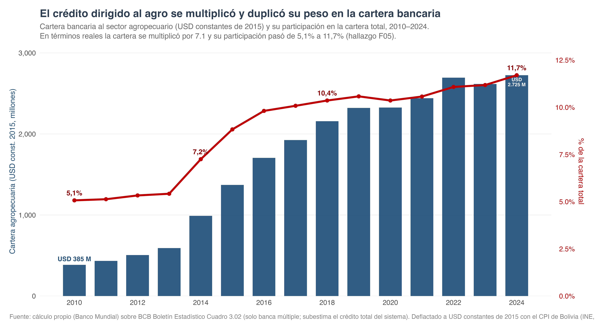
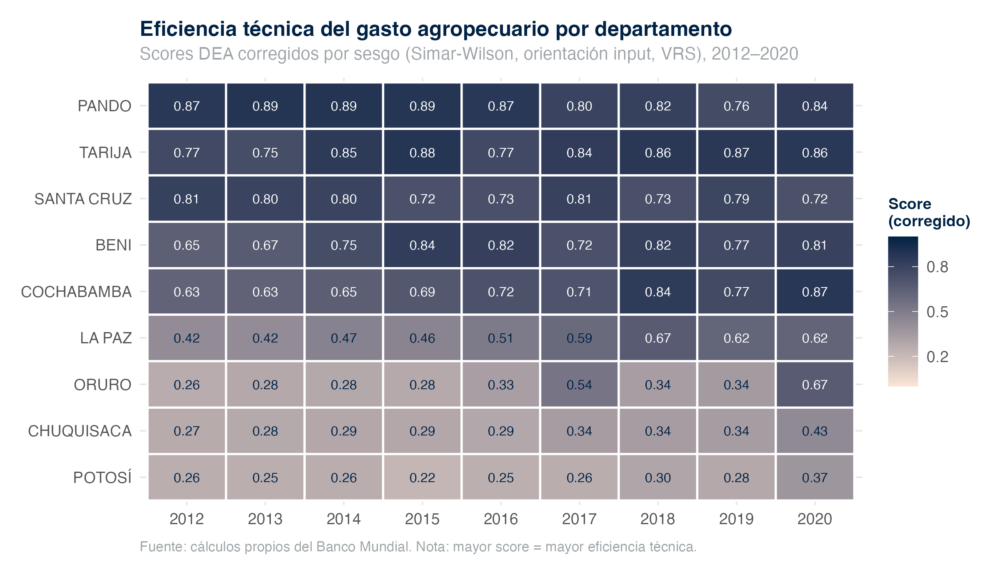
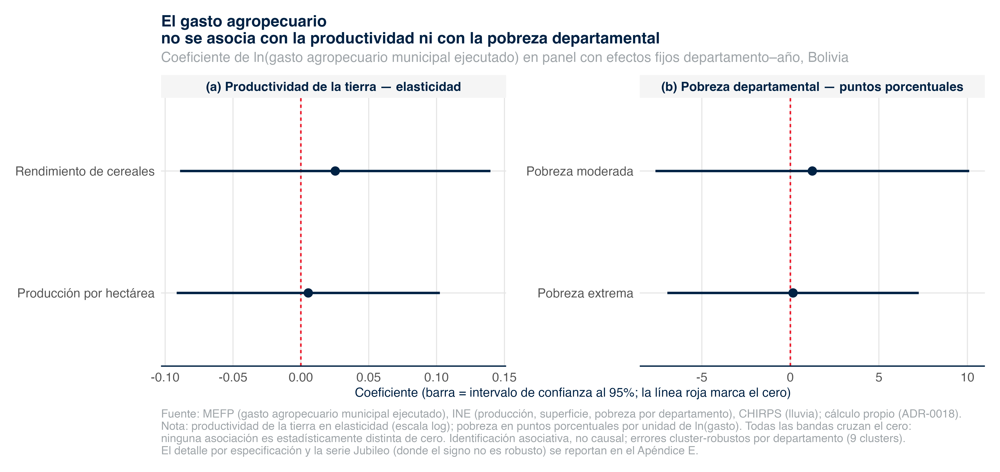
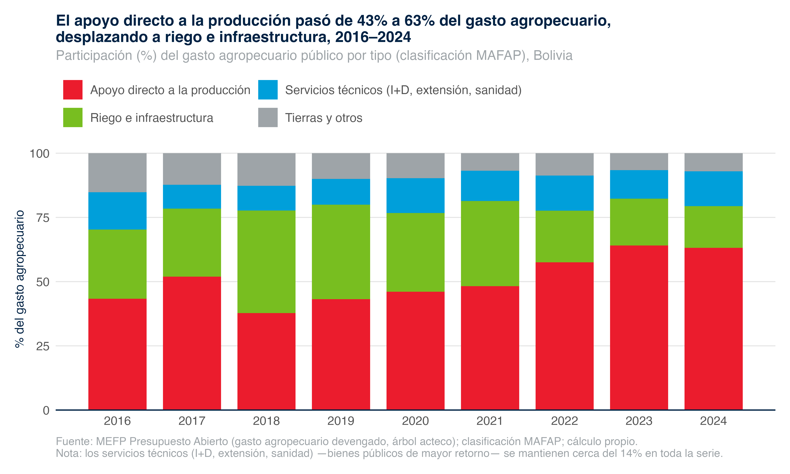
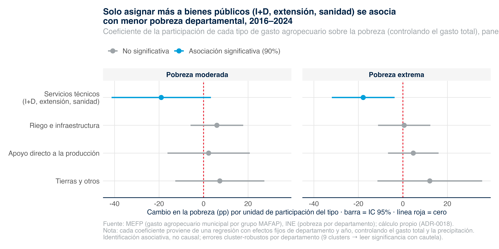

## Hoja de ruta

::: {.columns}
::: {.column}
**1 · El sector**

Desempeño productivo, estructura por cultivo y bienestar rural.

**2 · El gasto**

Magnitud, meta de Maputo, composición MAFAP y sustitución por crédito.

**3 · Eficiencia técnica**

Frontera departamental con DEA Simar-Wilson.
:::
::: {.column}
**4 · Gasto y resultados**

¿El gasto se traduce en productividad y menos pobreza?

**5 · Implicación de política**

El caso del *repurposing*: reasignar, no necesariamente gastar más.
:::
:::

::: {.source}
Cifras del panel maestro v12 (1990–2024) y del reporte técnico APER 2026. Identificación asociativa, no causal.
:::

# 1 · El sector {.section-header}

## El acertijo central: gasto que sube, productividad que no

::: {.columns}
::: {.column width="42%"}
::: {.metric}
::: {.metric-label}
Inversión pública agro · 2000–2015
:::
::: {.metric-big}
×10
:::
:::

::: {.metric}
::: {.metric-label}
Productividad total de factores · mismo período
:::
::: {.metric-big}
+30 %
:::
:::

La inversión se multiplicó por diez; la productividad apenas avanzó (**hallazgo F01**).
:::
::: {.column width="58%"}
{width="100%"}
:::
:::

## Bolivia crece más lento que sus pares andinos

{width="74%"}

::: {.source}
USDA-ERS, índice de TFP agropecuario. La brecha con Perú, Colombia y Ecuador es estructural.
:::

## Crecimiento extensivo: la soya manda, el rendimiento no sigue

::: {.columns}
::: {.column width="40%"}
::: {.metric}
::: {.metric-label}
Superficie de soya · 2000–2020
:::
::: {.metric-big}
×2,4
:::
:::

Rendimiento **+9,6 %** en dos décadas: el sector creció por **expansión de superficie**, no por intensificación.
:::
::: {.column width="60%"}
{width="100%"}
:::
:::

## Frontera que avanza, bienestar que se revierte

::: {.columns}
::: {.column}
::: {.metric}
::: {.metric-label}
Cobertura natural perdida · 1985–2024
:::
::: {.metric-big}
9,4 M ha
:::
:::

64 % en Santa Cruz · hallazgo **F08**
:::
::: {.column}
::: {.metric}
::: {.metric-label}
Inseguridad alimentaria (FIES) rural · 2024
:::
::: {.metric-big}
74 %
:::
:::

Era 49 % en 2019. La pobreza rural revirtió a **45 %** en 2024 · **F06**
:::
:::

# 2 · El gasto {.section-header}

## Bolivia nunca alcanzó la meta de Maputo

::: {.columns}
::: {.column width="40%"}
::: {.metric}
::: {.metric-label}
Máximo histórico (1990) · % del gasto público
:::
::: {.metric-big}
3,48 %
:::
:::

La meta del **10 %** nunca se logró (**F04**).

::: {.metric}
::: {.metric-label}
Apoyo al productor (PSE) · 2018 — 5° en LAC
:::
::: {.metric-big}
5,8 %
:::
:::

Por encima: Brasil, Chile, Colombia, Argentina · **F02**
:::
::: {.column width="60%"}
{width="100%"}
:::
:::

## Composición MAFAP: la mitad va a la producción, solo 12 % a bienes públicos

::: {.columns}
::: {.column width="38%"}
::: {.metric}
::: {.metric-label}
Bienes públicos de alto retorno (I+D, extensión, sanidad)
:::
::: {.metric-big}
12 %
:::
:::

Apoyo a la producción **51 %** (USD 205 M, incl. EMAPA ~33 %); riego 27 %; tierras y otros 10 %.

El gasto se concentra en una **intervención de mercado** (EMAPA) y en infraestructura; los bienes públicos de mayor retorno están **crónicamente sub-financiados**.
:::
::: {.column width="62%"}
{width="100%"}
:::
:::

## Del gasto fiscal al crédito subsidiado (Ley 393)

::: {.columns}
::: {.column width="40%"}
::: {.metric}
::: {.metric-label}
Cartera agro real · 2010–2024 (USD const. 2015)
:::
::: {.metric-big}
×7,1
:::
:::

USD 385 → 2 725 M. El factor nominal de ×11,7 incluye inflación.

La inversión pública cayó de **0,97 % del PIB (2015) a 0,38 % (2021)** · **F05**.
:::
::: {.column width="60%"}
{width="100%"}
:::
:::

# 3 · Eficiencia técnica {.section-header}

## La frontera departamental: un gradiente geográfico nítido

::: {.columns}
::: {.column width="40%"}
::: {.metric}
::: {.metric-label}
Eficiencia media corregida · DEA Simar-Wilson
:::
::: {.metric-big}
0,60
:::
:::

Rango 0,22–0,89.

Tierras bajas y valles cerca de la frontera (**Pando 0,85**); altiplano con las mayores brechas (**Potosí 0,27**). **Ningún departamento del altiplano** alcanzó la frontera.

La 2ª etapa (truncada) identifica la **precipitación** como determinante: parte de la brecha es agroecológica, no solo de gestión.
:::
::: {.column width="60%"}
{width="100%"}
:::
:::

# 4 · Gasto y resultados {.section-header}

## ¿El gasto se traduce en resultados? Tres mensajes

::: {.columns}
::: {.column}
**1 · El nivel no mueve los resultados**

A igual departamento, más gasto **no** se asocia de forma estable ni con la productividad de la tierra ni con la pobreza.

**2 · La composición se desplazó**

Apoyo directo a la producción **43 % → 63 %**; riego 27 % → 16 %; servicios técnicos estancados en ~14 %.
:::
::: {.column}
**3 · La composición sí importa**

A igual gasto total, más **bienes públicos** se asocia con **menos pobreza** (significativo en pobreza extrema).

::: {.callout}
Reasignar ~10 puntos del gasto hacia bienes públicos ≈ **2 puntos porcentuales menos de pobreza**.
:::
:::
:::

::: {.source}
Panel FE departamento × año, gasto MEFP 2016–2024 e INE. Especificación: ADR-0018. Asociativo, no causal; 9 clústeres.
:::

## Mensaje 1 — el nivel del gasto no mueve los resultados

{width="72%"}

## Mensaje 2 — la composición se desplazó

{width="72%"}

## Mensaje 3 — solo los bienes públicos se asocian con menos pobreza

{width="72%"}

# 5 · Implicación de política {.section-header}

## El margen está en reasignar, no en gastar más

::: {.columns}
::: {.column}
**La evidencia converge:**

- El **nivel** del gasto no mueve productividad ni pobreza (F01, §5.4).
- La **composición** sí: bienes públicos → menos pobreza.
- Los bienes públicos de mayor retorno (I+D, extensión, sanidad) están **estancados en ~14 %** y en retroceso relativo.
- El patrón dual de protección (NRP) grava exportables y protege alimentarios (F03).
:::
::: {.column}
**El caso del *repurposing*:**

A techo fiscal constante, desplazar la composición hacia bienes públicos puede mejorar resultados **sin gastar más**.

Reasignar No necesariamente más gasto

::: {.source}
Las opciones técnicas cuantificadas (S01–S03) se desarrollan en el capítulo de recomendaciones del reporte.
:::
:::
:::

## Síntesis — ocho hallazgos

::: {.columns}
::: {.column}
- **F01** Inversión ×10, TFP +30 %
- **F02** PSE 5,8 % (2018), 5° en LAC
- **F03** Patrón dual NRP (soya −37 %, maíz +46 %)
- **F04** Maputo nunca alcanzado (máx 3,48 %)
:::
::: {.column}
- **F05** Crédito ×7,1 real sustituye inversión
- **F06** Pobreza rural 45 %; FIES 49 → 74 %
- **F07** Ejecución subnacional limitada
- **F08** Frontera 9,4 M ha, 64 % Santa Cruz
:::
:::

::: {.callout-important}
El nivel del gasto no es el problema; **su composición** sí lo es. El repurposing hacia bienes públicos es el margen de mejora.
:::

## Gracias

**APER Bolivia 2026** · Agricultural Public Expenditure Review

Banco Mundial · Universidad EAFIT

::: {.source}
Sitio del proyecto: jcmunozmora.github.io/bolivia-wb-aper-2026 · Reproducible desde el panel maestro v12.
:::
