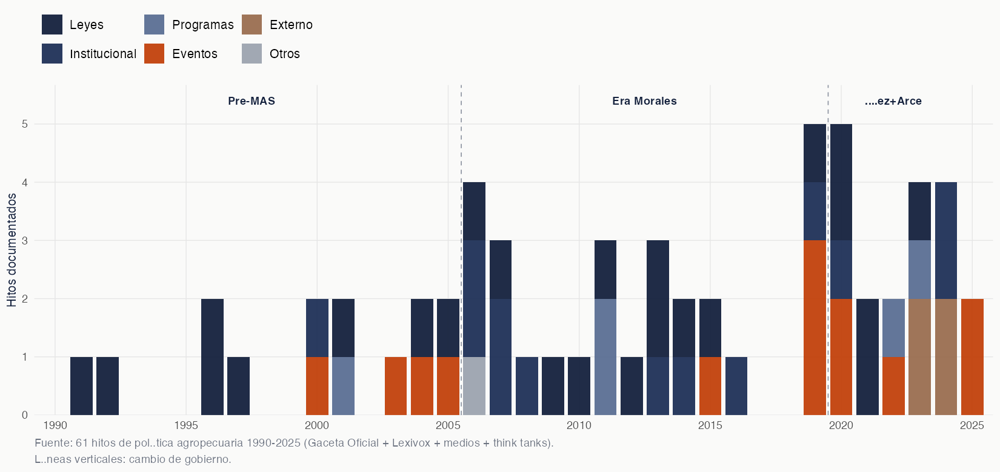
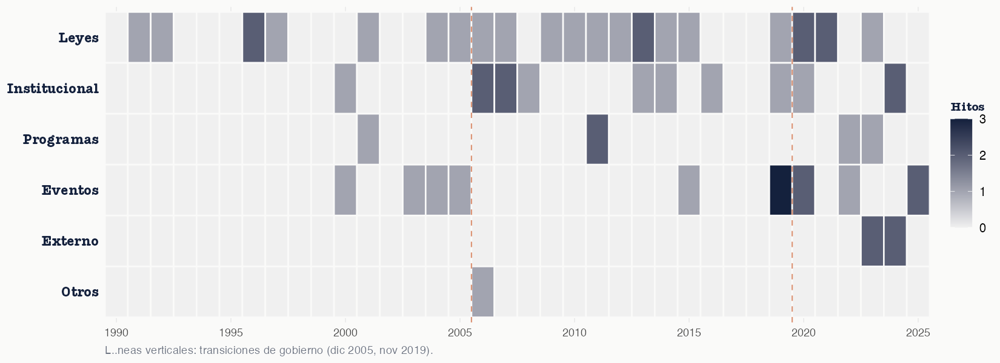
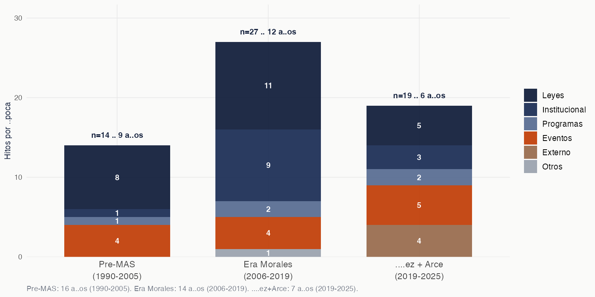

```{r}
#| include: false
suppressPackageStartupMessages({
  library(data.table); library(gt)
})
tl <- fread(here::here("01_data/timeline/timeline.csv"))
tl_data <- tl[Type != "title"]

fig <- function(name) paste0("figures/", name, ".png")

# Helper para galería
make_card <- function(year, headline, group, img_path, caption = "") {
  sprintf('<div class="tl-card"><div class="tl-card-body"><div class="tl-year">%d</div><div class="tl-headline">%s</div><div class="tl-group">%s</div></div></div>',
           img_path, headline, year, headline, group)
}
```

::: {.lead}
Documentamos 61 hitos de política agropecuaria boliviana entre 1990 y 2025: 24 leyes, 13 actos institucionales, 14 eventos políticos, 5 programas emblemáticos y 4 shocks externos. Cada hito tiene fecha exacta, fuente primaria, contexto narrativo de 150–300 palabras, imagen ilustrativa con licencia Creative Commons y vínculo al panel cuantitativo del estudio.
:::

## Composición de los hitos

```{r}
#| label: tbl-resumen
tl_data[, epoca := fcase(
  Year < 2006, "1990–2005 · Pre-MAS",
  Year < 2020, "2006–2019 · Era Morales",
  default     = "2019–2025 · Áñez + Arce"
)]
tl_sum <- tl_data[, .(`Hitos` = .N), by = .(`Período` = epoca, Grupo = Group)]
tl_sum[Grupo == "" | is.na(Grupo), Grupo := "Otros"]
tl_wide <- dcast(tl_sum, `Período` ~ Grupo, value.var = "Hitos", fill = 0)
gt(tl_wide) |>
  tab_header(title = md("**Hitos por período y categoría**")) |>
  tab_source_note(md("*Fuente: Gaceta Oficial + Lexivox + medios bolivianos + think tanks. 61 hitos validados.*")) |>
  opt_table_outline(style = "none")
```

## Densidad histórica de hitos



La densidad legislativa no es uniforme. Tres concentraciones destacan:

- **2006-2007**: arranque del proyecto MAS — creación del MDRyT, del PND 2006-2011, de EMAPA y del BDP. Reforma agraria (Ley 3545).
- **2010-2014**: período de máxima producción legislativa sectorial — Madre Tierra (071, 300), Revolución Productiva (144), Servicios Financieros (393), Alimentación Escolar (622), Agenda Patriótica.
- **2019-2024**: sucesión de eventos políticos y shocks — incendios Chiquitanía 2019, crisis post-electoral, COVID-19, OGM 2020, Censo 2022, crisis divisas, incendios Amazonía 2024.

## Patrón temático: heatmap año × categoría



El heatmap revela dos patrones temporales que las tablas no muestran tan bien:

- **Las leyes** se concentran en bloques: 1996-1997 (reforma neoliberal), 2010-2013 (Madre Tierra y revolución productiva), 2020-2023 (Áñez + Arce gestionan vía decreto).
- **Los eventos políticos y externos** se concentran en momentos de transición: 2003 (Octubre Negro), 2019 (Chiquitanía + crisis post-electoral), 2024 (incendios Amazonía + escasez combustibles).

## Distribución por época política



Tres lecturas estructurales:

- La **era Morales** concentra el mayor número absoluto de hitos institucionales y de leyes — coherente con un proyecto de transformación estatal del sector.
- El período **Áñez + Arce** muestra alta intensidad de eventos externos (4 de 14 totales del estudio) — refleja el ciclo de turbulencia 2019-2024.
- Los **programas emblemáticos** (PAR, CRIAR, EMPODERAR, MIAGUA) se concentran post-2010 — el aparato programático del MDRyT se consolida solo en la segunda fase del MAS.

## Línea de tiempo interactiva

::: {.column-screen-inset}

```{=html}
<link rel="stylesheet" href="assets/timeline-custom.css">
<div id="tl-app" role="region" aria-label="Línea de tiempo interactiva de política agropecuaria boliviana"></div>
<script src="assets/timeline-custom.js" defer></script>
```

:::

::: {.callout-note}
## Cómo navegar
- **Click en un dot** del eje temporal abre la ficha del hito en el panel superior.
- **Filtros** en la parte alta acotan por categoría (Leyes, Eventos, Programas, etc.).
- **Búsqueda** por palabras clave (busca en título, descripción y tags).
- **Flechas del teclado** (← →) avanzan entre hitos visibles.
- Las **bandas de gobierno** (Pre-MAS, Era Morales, Áñez+Arce) ayudan a ubicar el contexto político.
- Componente desarrollado en JavaScript vanilla — sin dependencias externas, funciona offline.
:::

## Galería visual de hitos

```{=html}
<style>
.tl-gallery {
  display: grid;
  grid-template-columns: repeat(auto-fill, minmax(220px, 1fr));
  gap: 1rem;
  margin: 2rem 0;
}
.tl-card {
  background: white;
  border: 1px solid #E5E5E5;
  overflow: hidden;
  transition: transform 0.18s ease, box-shadow 0.18s ease;
  display: flex;
  flex-direction: column;
}
.tl-card:hover {
  transform: translateY(-2px);
  box-shadow: 0 4px 14px rgba(20, 33, 61, 0.10);
  border-color: #14213D;
}
.tl-card img {
  width: 100%;
  height: 130px;
  object-fit: cover;
  background: #F5F5F5;
}
.tl-card-body {
  padding: 0.7rem 0.85rem;
  flex: 1;
  display: flex;
  flex-direction: column;
  gap: 0.25rem;
}
.tl-year {
  font-family: 'JetBrains Mono', monospace;
  font-size: 0.78rem;
  color: #C2410C;
  font-weight: 600;
  letter-spacing: 0.05em;
}
.tl-headline {
  font-size: 0.88rem;
  font-weight: 600;
  color: #14213D;
  line-height: 1.3;
  letter-spacing: -0.01em;
}
.tl-group {
  font-size: 0.7rem;
  color: #6B7280;
  text-transform: uppercase;
  letter-spacing: 0.07em;
  margin-top: auto;
  padding-top: 0.3rem;
}
.tl-section-label {
  font-size: 0.78rem;
  text-transform: uppercase;
  letter-spacing: 0.1em;
  color: #6B7280;
  font-weight: 600;
  margin: 2rem 0 0.8rem;
  padding-top: 1rem;
  border-top: 1px solid #E5E5E5;
}
</style>
```

```{r}
#| label: galeria
#| output: asis
tl_g <- copy(tl_data)
tl_g[, era_short := fcase(
  Year < 2006, "pre_2006",
  Year < 2020, "morales_2006_2019",
  default     = "anez_arce_2019_2025"
)]
tl_g[, hito_id := sprintf("%02d", .I + 1)]  # +1 porque excluimos title (id 01)

# Encontrar la imagen real para cada hito (extensión variable)
tl_g[, img_local := {
  d <- file.path("figures/timeline_media", era_short)
  candidates <- c(
    file.path(d, paste0("hito_", hito_id, ".jpg")),
    file.path(d, paste0("hito_", hito_id, ".png")),
    file.path(d, paste0("hito_", hito_id, ".jpeg"))
  )
  exist <- candidates[file.exists(file.path(here::here("www"), candidates))]
  if (length(exist) > 0) exist[1] else NA_character_
}, by = seq_len(nrow(tl_g))]

tl_g[Group == "" | is.na(Group), Group := "Otros"]

# Renderizar por época
for (era_lbl in c("1990–2005 · Pre-MAS", "2006–2019 · Era Morales", "2019–2025 · Áñez + Arce")) {
  era_filter <- switch(era_lbl,
                       "1990–2005 · Pre-MAS"        = tl_g$Year < 2006,
                       "2006–2019 · Era Morales"    = tl_g$Year >= 2006 & tl_g$Year < 2020,
                       "2019–2025 · Áñez + Arce"    = tl_g$Year >= 2020)
  sub <- tl_g[era_filter & !is.na(img_local)]
  setorder(sub, Year, Month, Day)

  cat(sprintf('\n<div class="tl-section-label">%s · %d hitos</div>\n', era_lbl, nrow(sub)))
  cat('<div class="tl-gallery">\n')
  for (i in seq_len(nrow(sub))) {
    cat(make_card(sub$Year[i], sub$Headline[i], sub$Group[i], sub$img_local[i]))
    cat('\n')
  }
  cat('</div>\n')
}
```

## Listado completo

### Pre-MAS · 1990–2005

```{r}
tl_data[Year < 2006,
   .(`Año` = ifelse(is.na(Month), as.character(Year),
                     sprintf("%d-%02d", Year, Month)),
     Hito = Headline,
     Grupo = Group)] |>
  setorder(`Año`) |>
  gt() |> opt_table_outline(style = "none")
```

### Era Morales · 2006–2019

```{r}
tl_data[Year >= 2006 & Year < 2020,
   .(`Año` = ifelse(is.na(Month), as.character(Year),
                     sprintf("%d-%02d", Year, Month)),
     Hito = Headline,
     Grupo = Group)] |>
  setorder(`Año`) |>
  gt() |> opt_table_outline(style = "none")
```

### Áñez + Arce · 2019–2025

```{r}
tl_data[Year >= 2020,
   .(`Año` = ifelse(is.na(Month), as.character(Year),
                     sprintf("%d-%02d", Year, Month)),
     Hito = Headline,
     Grupo = Group)] |>
  setorder(`Año`) |>
  gt() |> opt_table_outline(style = "none")
```

## Cómo se construyó

Cada hito cumple al menos uno de estos criterios:

1. **Instrumento legal**: ley o decreto supremo del sector.
2. **Programa emblemático**: presupuesto ≥ USD 10 M o impacto ≥ 10 000 beneficiarios.
3. **Evento externo**: shock con impacto ≥ 1 % del PIB agropecuario.
4. **Acuerdo / cumbre**: que produjo decisiones vinculantes.

Cada hito tiene fecha exacta, fuente primaria (Gaceta Oficial / Lexivox / FAOLEX), al menos una fuente secundaria (medio o think tank), descripción contextual de 150–300 palabras y vínculo al panel cuantitativo del estudio.

## Recursos descargables

[Timeline CSV (formato KnightLab)](downloads/timeline.csv){.download-btn}
[Timeline JSON (embed nativo)](downloads/timeline.json){.download-btn}
[Vista previa simplificada (CSV)](downloads/timeline_preview.csv){.download-btn}
[Fuentes detalladas en GitHub](https://github.com/jcmunozmora/bolivia-wb-aper-2026/blob/main/01_data/timeline/sources.md){.download-btn}
